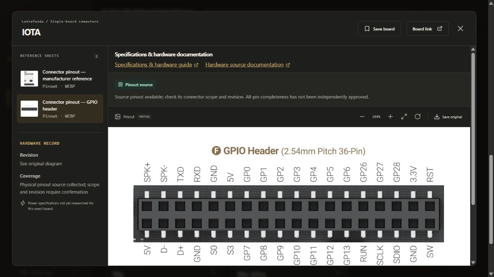
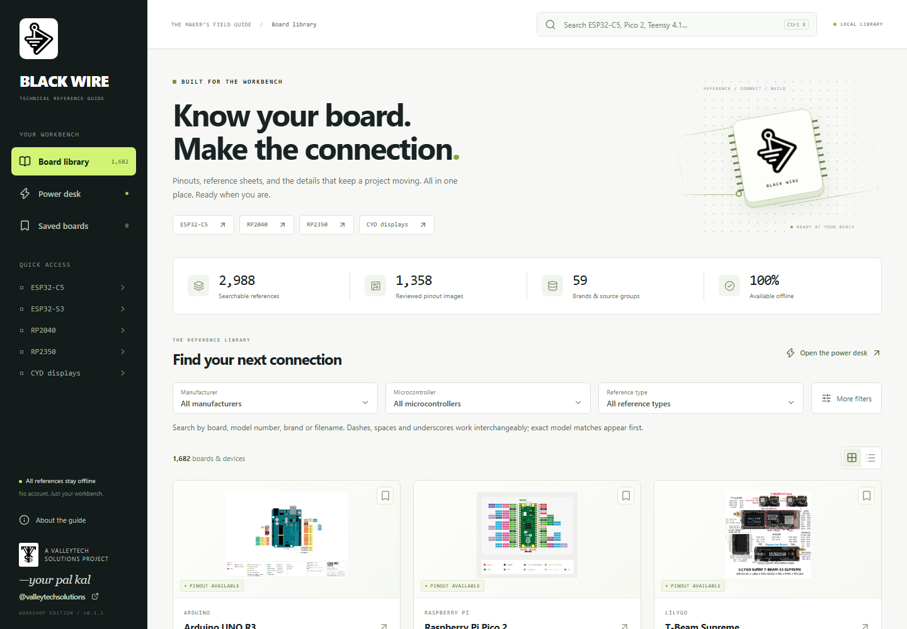
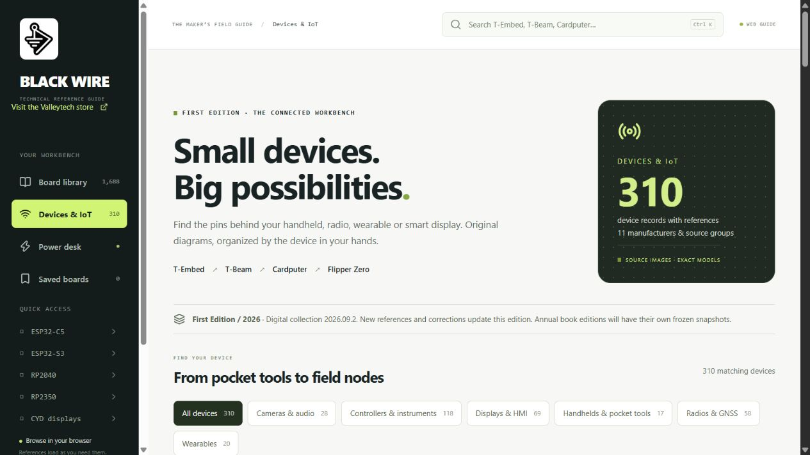

<p align="center">
   &nbsp;&nbsp;
  
</p>
<h1 align="center">The Black Wire Maker's<br>Technical Reference Guide</h1>
<p align="center"><strong>Know your board. Make the connection.</strong><br>A Valleytech Solutions project, made for the workbench.</p>
<p align="center">Makers · Educators · Students · Hobbyists · Engineers</p>

<p align="center"><a href="https://github.com/valleytechsolutions/black-wire-pinouts/releases">Download the collection</a> · <a href="BROWSE.md">Browse boards</a> · <a href="catalog/attributions.csv">Source credits</a> · <a href="https://github.com/valleytechsolutions/black-wire-desktop/releases">Download the desktop app</a> · <a href="CONTRIBUTING.md">Contribute a reference</a></p>

## Find a pinout, then build

**[Search the guide](https://valleytech-black-wire-guide.pages.dev/) · [Read the reference wiki](https://valleytech-black-wire-guide.pages.dev/wiki/) · [Browse maker modules](https://valleytech-black-wire-guide.pages.dev/wiki/modules/) · [Get the Windows app](https://github.com/valleytechsolutions/black-wire-desktop/releases/latest)**

Board and device references for **ESP32, Arduino, Raspberry Pi, RP2040/RP2350**, displays, sensors, buttons, interfaces and power modules. Find physical pinout sources, supporting photos, pin-purpose tables and manufacturer documentation, with revision and coverage notes. Generic modules and documentation gaps remain visible.

The companion app **0.7.0** adds SBC/architecture filters and visible specifications links. The current hardware collection is snapshot **2026.09.7**. [How to read a pinout](https://valleytech-black-wire-guide.pages.dev/wiki/reading-pinouts/) · [Contribute or report a correction](CONTRIBUTING.md).

## Manufacturer and SBC expansion / snapshot 2026.09.7

**107 additional listings · 229 additional reference entries · 127 additional physical pinout-image entries.** Expanded Adafruit and SparkFun references, FPGA boards, H4M, eight LattePanda models and Milk-V Mars. [Additions, source corrections and remaining gaps](docs/EXPANSION-2026.09.7.md).



## Previous quality update / snapshot 2026.09.6

Added two distinct SparkFun ESP32 Thing Plus models, their original pinout PDFs and page-rendered sheets, plus supporting references for Pro Micro RP2350, Thing Plus RP2350 and ESP32-P4-Function-EV-Board v1.5.2. The current catalog has **2,407 board/device listings**, **486 maker listings**, **3,011 board reference entries** and **1,369 pinout image entries**. [Audit, evidence and remaining gaps](docs/QUALITY-AUDIT-2026.09.6.md).

## Previous pin-reference expansion / snapshot 2026.09.5

Every one of the 2,891 board and maker listings now has an explicit pinout-coverage status. Linked listings may describe the same hardware. [Coverage audit and remaining work](PINOUT_COVERAGE.md).

This update adds **46 annotated manufacturer-model connector sheets** covering 637 modeled contacts, **58 source pin tables** containing 633 rows, and 17 additional source-image attachments. Pin details are recorded for 70 maker listings. The sheets use source-model contact positions; K keys are editorial identifiers. Signal-name purpose explanations, transcribed manufacturer facts and independent electrical approval are different evidence levels.

Of 486 maker listings, **151 have physical pinout sources, 30 have functions only, 288 have supporting references only, and 17 have no reference**. Of 2,405 board listings, 875 have pinout sources, 3 have functions only, 811 have supporting references only, and 716 await documentation. No listing is independently approved as a complete all-connector reference. Five dense or ambiguous models were withheld. The primary-source intake attempted 1,499 pages; 336 retrieval failures remain recorded.

Manufacturer originals remain intact. The annotated Adafruit sheets are CC BY-SA 3.0 adaptations with attribution and exact source hashes. Other source rights remain per asset. The First Edition book is an unfinished editorial draft.

## Maker expansion / September 2026

[Browse displays, sensors and modules](MAKERS.md) or [search the parts desk](https://valleytech-black-wire-guide.pages.dev/?tab=makers). The intake has **486 records**: **159 named-product records**, **43 manufacturer-family records**, **268 existing collection references** and **16 generic families** needing identification. Manufacturer documentation is recorded for 196 listings. These are source records, not 486 newly completed pinouts. [Coverage and product roadmap](docs/MAKER_ROADMAP.md).

## A reference shelf for your next project

Find the picture that tells you **which physical pin does what**. This collection brings together original board pinouts, connector labels, GPIO references and supporting documents, organized by manufacturer, processor and exact board identity. The companion desktop app makes the same collection searchable offline.

| First Edition · snapshot 2026.09.7 | Count |
|---|---:|
| Board pinout source image entries | **1,496** |
| Searchable reference entries | **3,240** |
| Catalog records with files | **1,806** |
| Manufacturers and source groups | **64** |
| Unique original media files, including vector companions | **3,188** |

Records include shared references, variants, devices and unreviewed source products. These counts are **not a census of unique development boards**. Coverage is growing; it is not complete.



## Devices & IoT

**[Browse 313 device records](DEVICES.md)** or use the new **[Devices & IoT tab](https://valleytech-black-wire-guide.pages.dev/?tab=devices)**. Find T-Embed, T-Beam, T-Deck, Cardputer, Flipper, wearables, LoRa nodes, smart displays and controllers by category, manufacturer and MCU. Missing sheets and in-development documentation are explicitly labeled.



This update adds **15 original images, including 7 pinout/connector sheets**, and six newly populated device records. [First Edition policy and update details](EDITION.md).

## Find your board

**[Search the complete current collection in your browser](https://valleytechsolutions.tech/pages/bwm-technical-reference-guide)** on the Valleytech store. No download or installation is needed. The [full-screen guide](https://valleytech-black-wire-guide.pages.dev/) includes manufacturer/processor filters, pinout viewing and power tools.

Start at **[Browse manufacturers and boards](BROWSE.md)**. Each board page includes a preview, original-resolution downloads, model/revision notes, and source credits. ESP32-C5, C6, S3 and other variants remain separate; RP2040, RP2350, CYD, Arduino, Teensy, SBCs and devices with GPIO have their own records.

| What you need | Where to look |
|---|---|
| Physical board pins | Board pages marked **pinout image** |
| Connector or GPIO labels | **GPIO reference image** and **board labeling image** |
| Manuals, schematics or supporting material | **Original PDF** / **source reference**; check the review label |
| Full-resolution originals | `library/media/`; linked from every board page |
| Provenance, hashes and rights | [`catalog/attributions.csv`](catalog/attributions.csv) and [`library/catalog.json`](library/catalog.json) |
| Fast offline search and power tools | [Black Wire desktop](https://github.com/valleytechsolutions/black-wire-desktop) |

Original files are stored once by content hash; board pages provide the human-friendly organization. Shared images remain linked to all applicable records. Thumbnails and large-image previews are convenience derivatives, not replacements for the originals.

## Use it offline

Download a versioned ZIP from this repository's **[collection releases](https://github.com/valleytechsolutions/black-wire-pinouts/releases)**. Each release includes the full reference collection, board indexes, source credits, license/rights notices and a SHA-256 checksum. Extract the whole ZIP and begin with `README.md` and `BROWSE.md`. The files work on **Windows, Linux and macOS** with an image/PDF viewer and a Markdown reader; no installer is needed for the collection.

The guide remains **First Edition / 2026**. The latest collection snapshot is **[2026.09.7 — Manufacturer and SBC expansion](https://github.com/valleytechsolutions/black-wire-pinouts/releases/tag/v2026.09.7)**; [2026.09.1](https://github.com/valleytechsolutions/black-wire-pinouts/releases/tag/v2026.09.1) remains available unchanged. Collection snapshots and app versions are independent of the future annual book editions; see [EDITION.md](EDITION.md). The [desktop repository](https://github.com/valleytechsolutions/black-wire-desktop/releases) provides application installers and states which operating systems actually have downloads.

You can also clone the current repository (about **1.8 GB** of reference data). Keep the folder structure intact. Local Markdown viewers can follow the board pages; the desktop app provides the full searchable image/PDF interface. See [release and checksum instructions](RELEASES.md).

```sh
git clone https://github.com/valleytechsolutions/black-wire-pinouts.git
```

## Attribution, quality and publication

**Original guide/editorial and compilation contributions are [CC BY 4.0](LICENSING.md): reuse, adapt and share, including commercially, with attribution to Kal / Valleytech Solutions, a license link and a note of changes.** See [suggested attribution](NOTICE.md) and [privacy](PRIVACY.md).

Read [ATTRIBUTION.md](ATTRIBUTION.md) and [RIGHTS.md](RIGHTS.md). Every image retains its recorded source, rights status and SHA-256. **Attribution is not permission to relicense or commercially print an image.** Many source licenses have not yet been established; any book edition needs a rights review for those images. No collection-wide open license is claimed for manufacturer artwork.

“Reviewed” means categorized against its source, not electrically bench-verified. Some references have unidentified revisions, partial maps or low resolution. Chip-package diagrams are separately labeled and excluded from the physical-board pinout count. One unreviewed reSpeaker Lite source PNG is truncated; its original is retained with a preview-error note.

## Help build the field guide

Send a board reference, correction, revision clarification, a better original or verified license information through [the contribution template](CONTRIBUTING.md). The long-term direction is an offline reference app, a browsable wiki and annual book editions; the digital collection, public wiki and workshop app are available today.

---
Created and curated by **—your pal kal** · [@valleytechsolutions on YouTube](https://www.youtube.com/@valleytechsolutions)

Black Wire and Valleytech logos belong to their creator. Manufacturer names and trademarks identify the referenced hardware; they do not imply endorsement.

## Maker image update / 2026.09.4

467 of 486 maker records now have visual references, including 327 newly collected unique image files and 58 physical connector/pinout source images. Identification photos, schematics, partial pinouts and technical-review status are labeled separately. 29 power records were added. [Image gaps](catalog/maker-image-gaps.json) and [image provenance](catalog/maker-attributions.json) remain explicit. These are source references, not complete-device approvals or worldwide completeness claims. Manufacturer originals are unchanged; unknown rights are not a grant for printing or other reuse.
