# Wiring & protocols

Original Black Wire connection diagrams and concise guides. These are distinct from physical board pinouts.

[Open the wiring desk](https://valleytech-black-wire-guide.pages.dev/?tab=wiring)

Documentation reviewed; not independently bench-tested. Identify exact hardware, connector orientation and logic levels before wiring.

## [RJ45 / 8P8C Ethernet: T568A and T568B](https://valleytech-black-wire-guide.pages.dev/wiki/wiring/ethernet-t568/)

Match numbered contacts and twisted pairs when terminating Ethernet cable.

[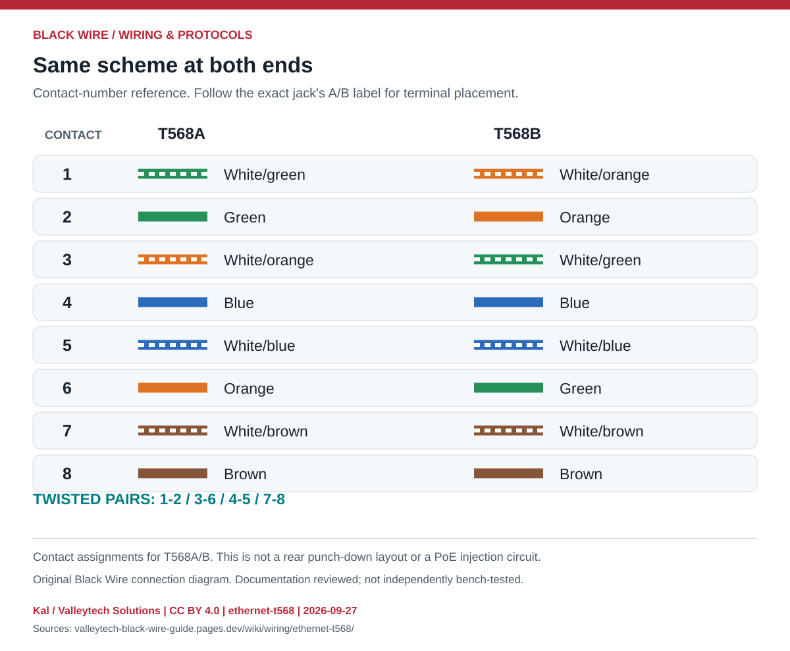](library/wiring/ethernet-t568.svg)

Contact assignments for T568A/B. This is not a rear punch-down layout or a PoE injection circuit.

Sources: [Leviton Cat 5e / Cat 6 jack instructions](https://leviton.com/content/dam/leviton/network-solutions/product_documents/instruction_sheet/Leviton_IST_5G110_61110_eXtreme_Cat5e_Cat6_Jacks.pdf) · [Fluke Networks: RJ connector naming](https://www.flukenetworks.com/blog/cabling-chronicles/history-rj45-case-mistaken-identity)

## [Phone jacks: RJ11, RJ14 and USOC terminals](https://valleytech-black-wire-guide.pages.dev/wiki/wiring/telephone-jacks/)

Recognize telephone connector families and a documented screw-terminal conversion.

[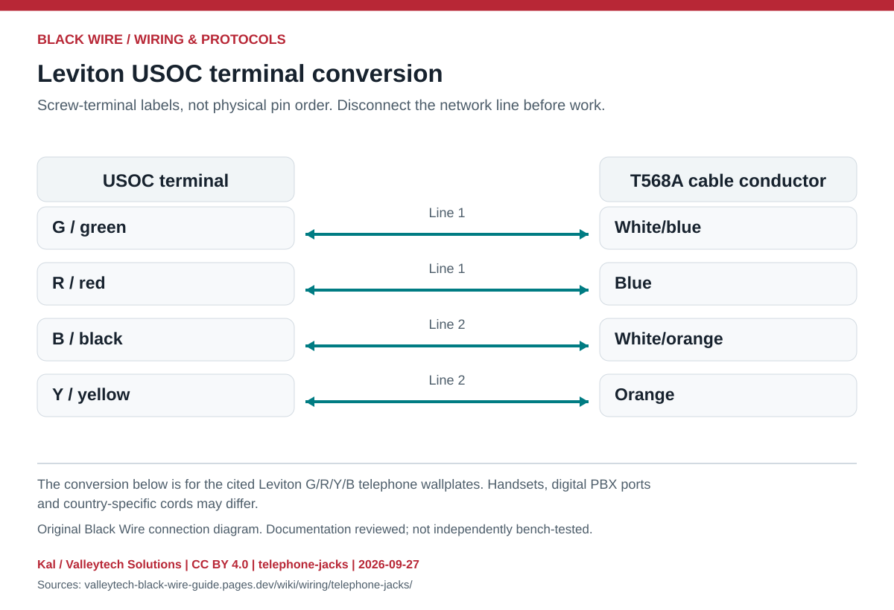](library/wiring/telephone-jacks.svg)

The conversion below is for the cited Leviton G/R/Y/B telephone wallplates. Handsets, digital PBX ports and country-specific cords may differ.

Sources: [Leviton telephone wallplates, PK-93298-10-02-0H](https://leviton.com/content/dam/leviton/network-solutions/product_documents/instruction_sheet/Leviton-IST-Telephone-Wallplates.pdf) · [Fluke Networks: RJ connector naming](https://www.flukenetworks.com/blog/cabling-chronicles/history-rj45-case-mistaken-identity)

## [UART: TX, RX and a shared reference](https://valleytech-black-wire-guide.pages.dev/wiki/wiring/uart-logic/)

Connect a logic-level serial adapter to a compatible board console.

[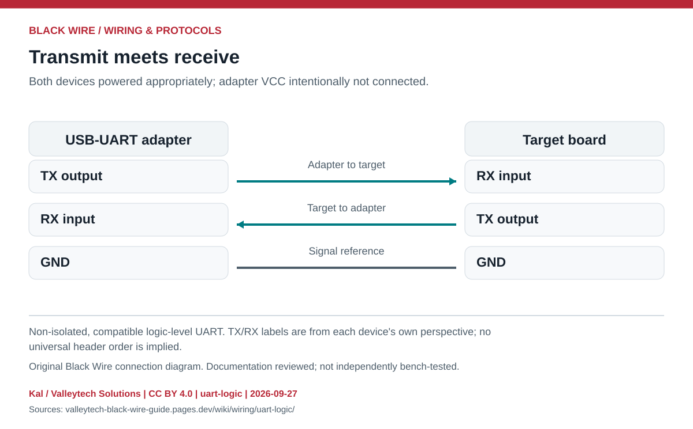](library/wiring/uart-logic.svg)

Non-isolated, compatible logic-level UART. TX/RX labels are from each device's own perspective; no universal header order is implied.

Sources: [Analog Devices: UART communication](https://www.analog.com/en/resources/analog-dialogue/articles/uart-a-hardware-communication-protocol.html) · [Analog Devices: RS-232 fundamentals](https://www.analog.com/en/resources/technical-articles/fundamentals-of-rs232-serial-communications.html)

## [RS-232: put a transceiver between UART and cable](https://valleytech-black-wire-guide.pages.dev/wiki/wiring/rs232-interface/)

Understand why an RS-232 port cannot connect straight to a logic-level UART.

[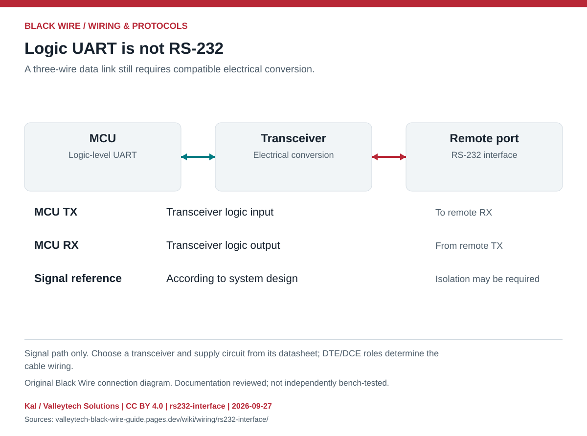](library/wiring/rs232-interface.svg)

Signal path only. Choose a transceiver and supply circuit from its datasheet; DTE/DCE roles determine the cable wiring.

Sources: [Analog Devices: RS-232 fundamentals](https://www.analog.com/en/resources/technical-articles/fundamentals-of-rs232-serial-communications.html)

## [RS-485: a half-duplex multidrop bus](https://valleytech-black-wire-guide.pages.dev/wiki/wiring/rs485-bus/)

Connect differential transceivers on a bus with controlled transmit direction.

[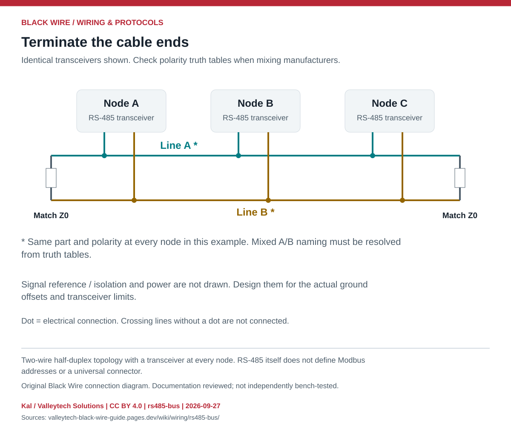](library/wiring/rs485-bus.svg)

Two-wire half-duplex topology with a transceiver at every node. RS-485 itself does not define Modbus addresses or a universal connector.

Sources: [Texas Instruments: RS-485 Design Guide, SLLA272D](https://www.ti.com/lit/an/slla272d/slla272d.pdf) · [Analog Devices: AN-960 RS-485/RS-422 implementation](https://www.analog.com/en/resources/app-notes/an-960.html)

## [CAN bus: controller, transceiver and termination](https://valleytech-black-wire-guide.pages.dev/wiki/wiring/can-bus/)

Separate the MCU's CAN signals from the two-wire physical bus.

[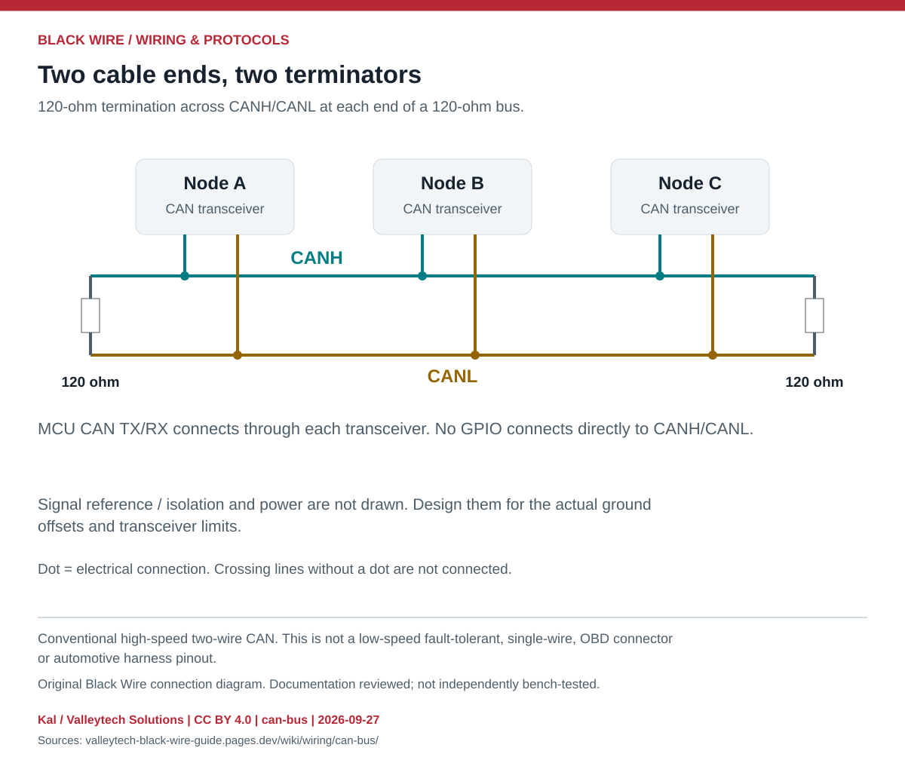](library/wiring/can-bus.svg)

Conventional high-speed two-wire CAN. This is not a low-speed fault-tolerant, single-wire, OBD connector or automotive harness pinout.

Sources: [Texas Instruments: CAN physical layer, SLLA270](https://www.ti.com/lit/an/slla270/slla270.pdf)

## [I2C: two shared lines with pull-ups](https://valleytech-black-wire-guide.pages.dev/wiki/wiring/i2c-bus/)

Wire SDA and SCL for compatible sensors on a short local bus.

[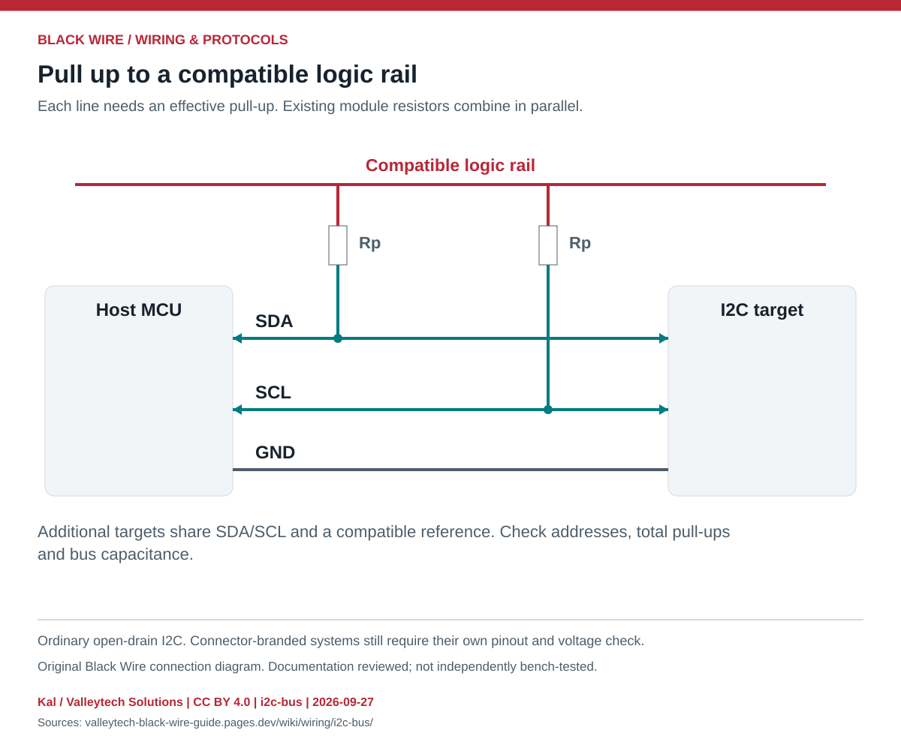](library/wiring/i2c-bus.svg)

Ordinary open-drain I2C. Connector-branded systems still require their own pinout and voltage check.

Sources: [NXP: I2C specification, UM10204](https://www.nxp.com/docs/en/user-guide/UM10204.pdf)

## [SPI: clock, data direction and chip select](https://valleytech-black-wire-guide.pages.dev/wiki/wiring/spi-bus/)

Connect a host to a four-wire SPI peripheral without crossing the data roles.

[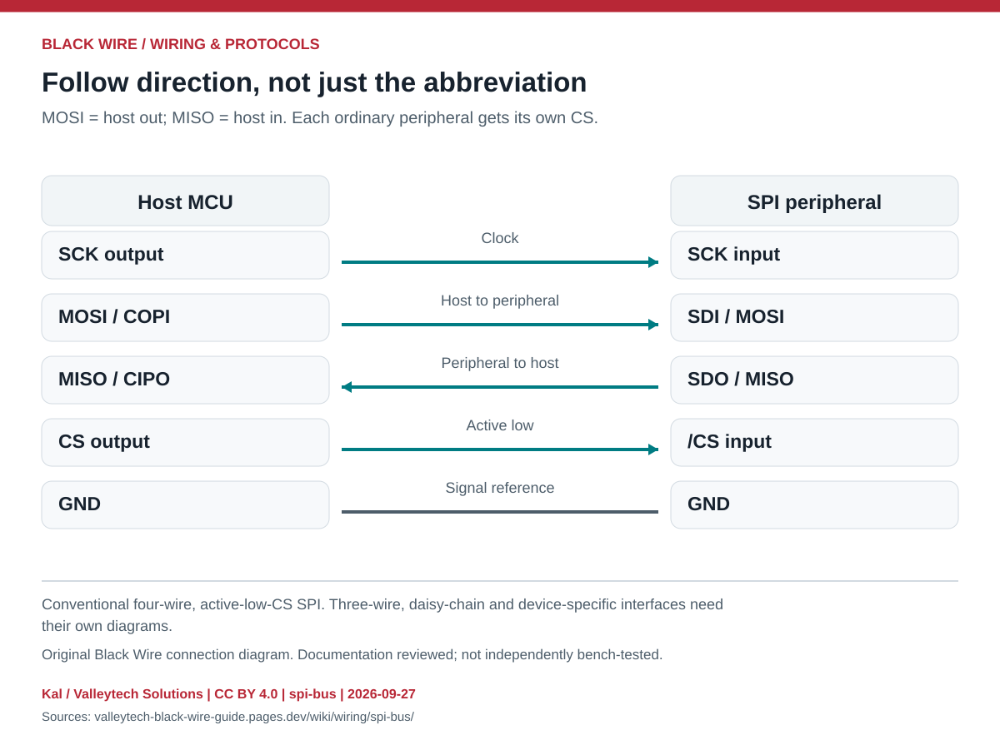](library/wiring/spi-bus.svg)

Conventional four-wire, active-low-CS SPI. Three-wire, daisy-chain and device-specific interfaces need their own diagrams.

Sources: [Analog Devices: Introduction to SPI Interface](https://www.analog.com/en/resources/analog-dialogue/articles/introduction-to-spi-interface.html)

## [SWD: connect a Cortex debug probe](https://valleytech-black-wire-guide.pages.dev/wiki/wiring/swd-debug/)

Map the essential debug signals without confusing voltage sense with a power output.

[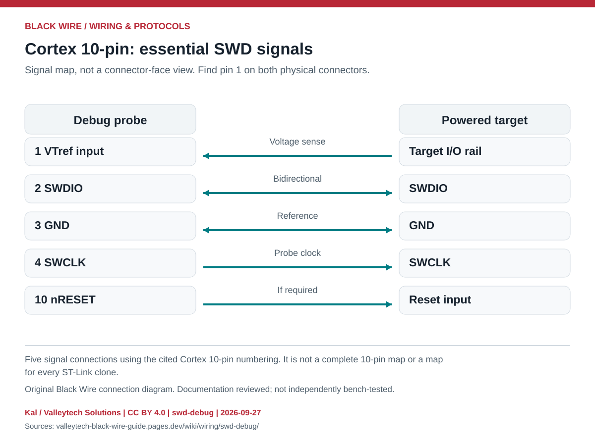](library/wiring/swd-debug.svg)

Five signal connections using the cited Cortex 10-pin numbering. It is not a complete 10-pin map or a map for every ST-Link clone.

Sources: [Microchip: Cortex Debug Connector (10-pin)](https://onlinedocs.microchip.com/oxy/GUID-DDF2C9BC-07FB-4ABF-938A-774B157B4519-en-US-10/GUID-602387F5-19D1-482F-8A0C-C85CD731F978.html) · [Arm Keil: Application Note 321, version 1.1](https://www.keil.com/appnotes/files/apnt_321_v1.1.pdf)

## [JTAG: TCK, TMS, TDI and TDO](https://valleytech-black-wire-guide.pages.dev/wiki/wiring/jtag-debug/)

Understand the four core JTAG signals and their direction at a target.

[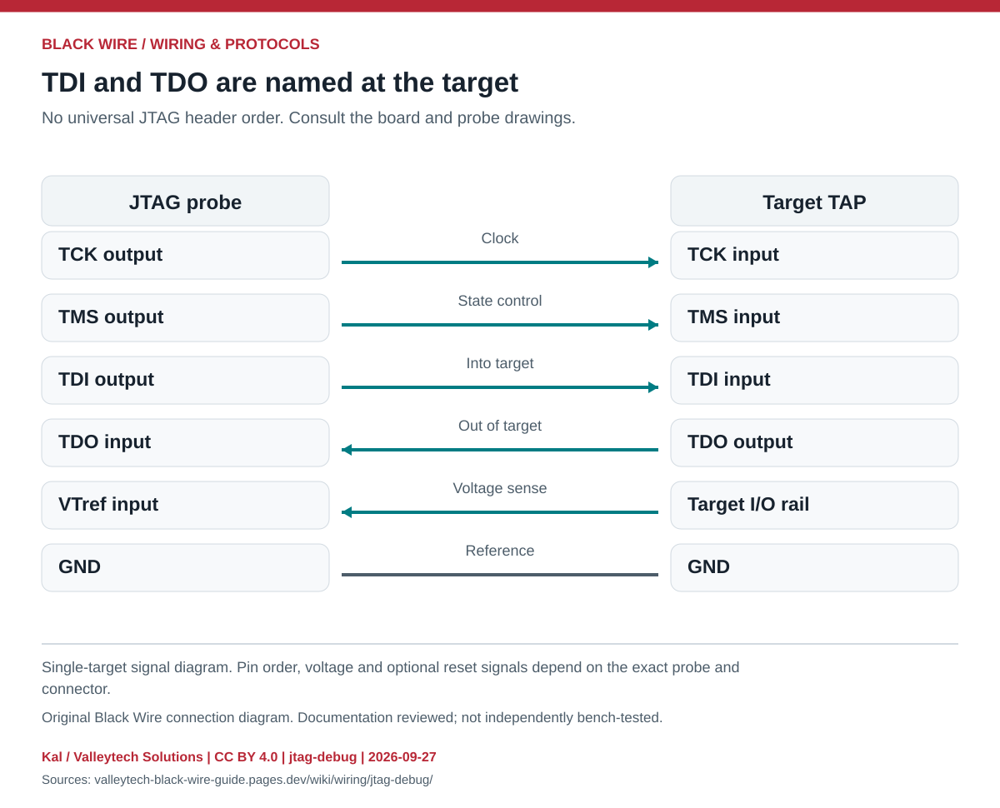](library/wiring/jtag-debug.svg)

Single-target signal diagram. Pin order, voltage and optional reset signals depend on the exact probe and connector.

Sources: [SEGGER: J-Link interface description](https://www.segger.com/products/debug-probes/j-link/technology/interface-description/)

## [RFID / NFC: reader, writer or emulator?](https://valleytech-black-wire-guide.pages.dev/wiki/wiring/rfid-nfc-roles/)

Choose the radio, supported tag protocol and host interface before choosing wires.

[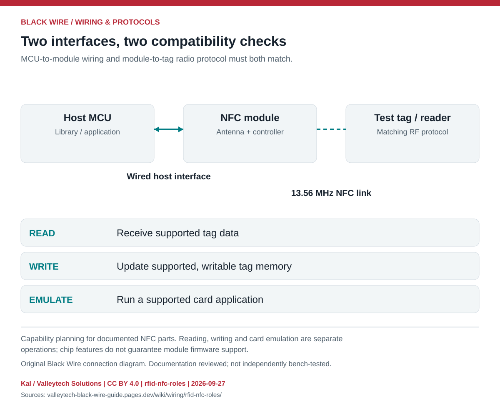](library/wiring/rfid-nfc-roles.svg)

Capability planning for documented NFC parts. Reading, writing and card emulation are separate operations; chip features do not guarantee module firmware support.

Sources: [STMicroelectronics: ST25R3916B / 3917B / 3919B datasheet](https://www.st.com/resource/en/datasheet/st25r3916b.pdf) · [NXP: PN532/C1 datasheet](https://www.nxp.com/docs/en/nxp/data-sheets/PN532_C1.pdf) · [NXP: PN7160 card emulation, AN13861](https://www.nxp.com/docs/en/application-note/AN13861.pdf) · [NXP: PN5180 product documentation](https://www.nxp.com/products/PN5180)

## [ELECHOUSE ST25R3916B: SPI wiring](https://valleytech-black-wire-guide.pages.dev/wiki/wiring/st25r3916b-spi/)

Signal connections for the seven-pin module in the V0.3 Draft datasheet.

[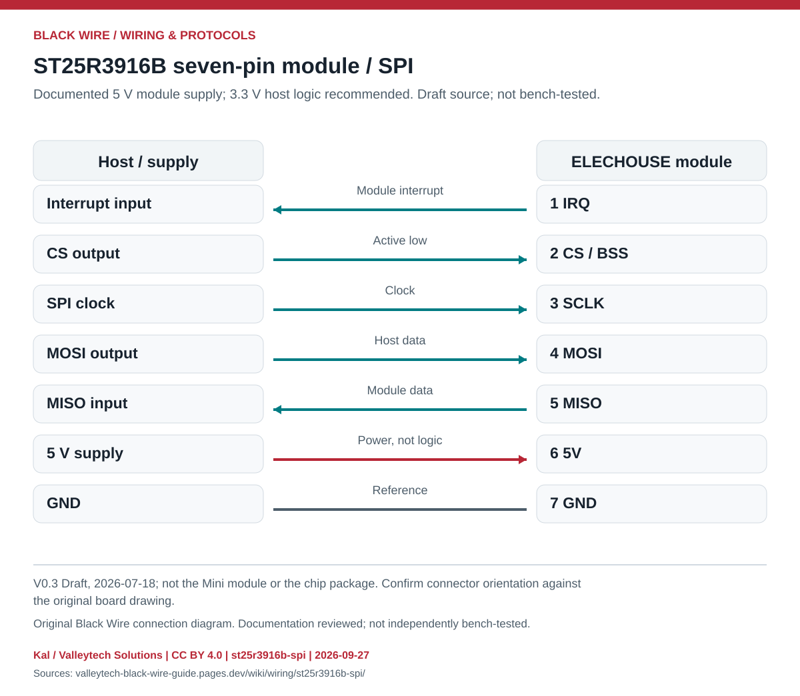](library/wiring/st25r3916b-spi.svg)

V0.3 Draft, 2026-07-18; not the Mini module or the chip package. Confirm connector orientation against the original board drawing.

Sources: [ELECHOUSE ST25R3916B module, V0.3 Draft](https://www.elechouse.com/wp-content/uploads/2026/07/ST25R3916B_NFC_Module_Datasheet.pdf) · [Analog Devices: Introduction to SPI Interface](https://www.analog.com/en/resources/analog-dialogue/articles/introduction-to-spi-interface.html)

## [ELECHOUSE ST25R3916B: I2C wiring](https://valleytech-black-wire-guide.pages.dev/wiki/wiring/st25r3916b-i2c/)

The same module changes pin functions after hardware mode selection.

[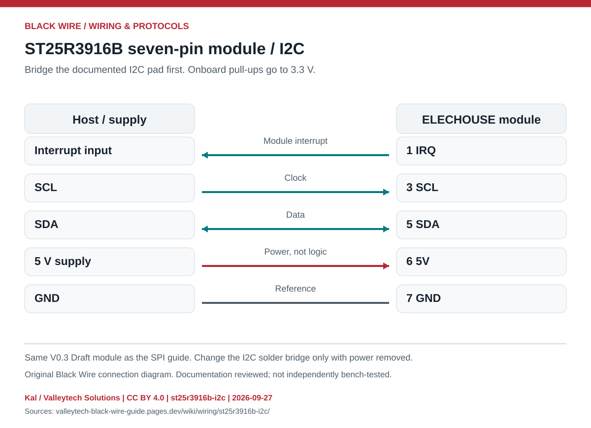](library/wiring/st25r3916b-i2c.svg)

Same V0.3 Draft module as the SPI guide. Change the I2C solder bridge only with power removed.

Sources: [ELECHOUSE ST25R3916B module, V0.3 Draft](https://www.elechouse.com/wp-content/uploads/2026/07/ST25R3916B_NFC_Module_Datasheet.pdf) · [NXP: I2C specification, UM10204](https://www.nxp.com/docs/en/user-guide/UM10204.pdf)

## [ELECHOUSE PN7160 MINI V1: I2C wiring](https://valleytech-black-wire-guide.pages.dev/wiki/wiring/pn7160-mini-i2c/)

Wire the six-pin MINI module without borrowing the standard module's eight-pin map.

[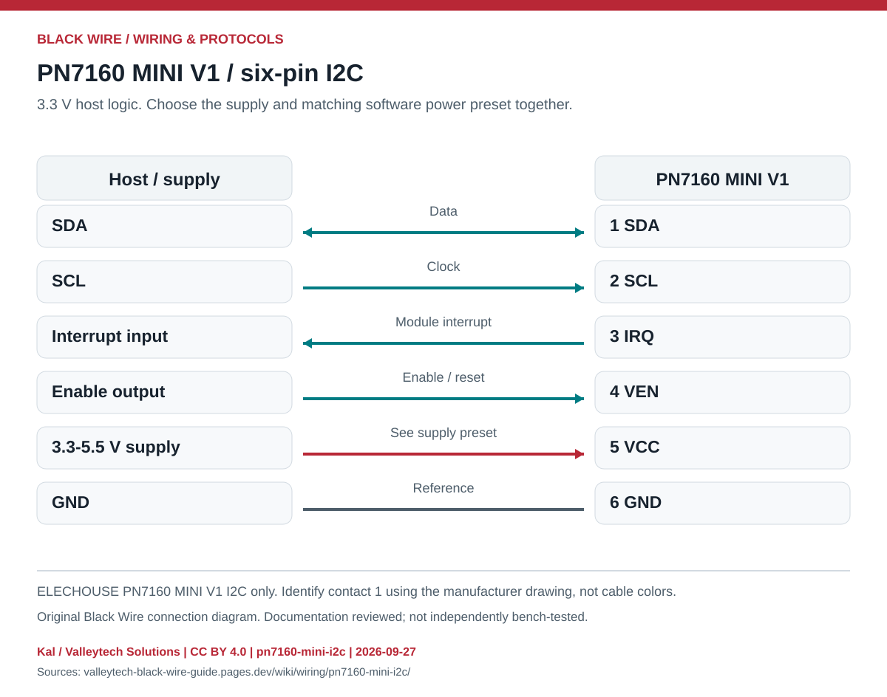](library/wiring/pn7160-mini-i2c.svg)

ELECHOUSE PN7160 MINI V1 I2C only. Identify contact 1 using the manufacturer drawing, not cable colors.

Sources: [ELECHOUSE PN7160 MINI V1 I2C datasheet](https://www.elechouse.com/docs/pn7160-mini-v1-i2c/datasheet.html) · [ELECHOUSE PN7160 MINI V1 quick start](https://www.elechouse.com/docs/pn7160-mini-v1-i2c/quick-start.html) · [NXP: PN7160 card emulation, AN13861](https://www.nxp.com/docs/en/application-note/AN13861.pdf)

## [ELECHOUSE PN532 V3: choose the host mode](https://valleytech-black-wire-guide.pages.dev/wiki/wiring/pn532-v3-modes/)

Select UART, I2C or SPI before following that interface's wiring diagram.

[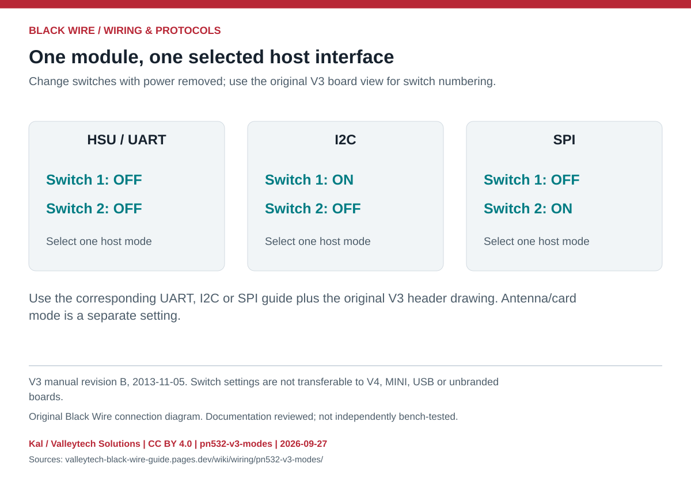](library/wiring/pn532-v3-modes.svg)

V3 manual revision B, 2013-11-05. Switch settings are not transferable to V4, MINI, USB or unbranded boards.

Sources: [ELECHOUSE PN532 V3 user manual, revision B](https://www.elechouse.com/elechouse/images/product/PN532_module_V3/PN532_%20Manual_V3.pdf) · [NXP: PN532/C1 datasheet](https://www.nxp.com/docs/en/nxp/data-sheets/PN532_C1.pdf)

Original diagrams and editorial text: Kal / Valleytech Solutions, [CC BY 4.0](LICENSE). Manufacturer sources keep their own rights.
