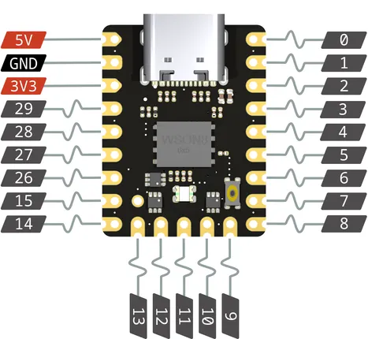
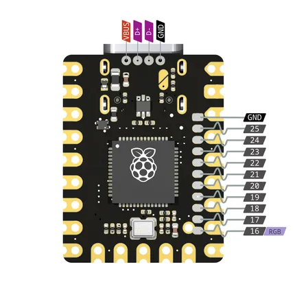

# Gemini

**0xCB** · RP2040

Revision: Not identified  
Coverage: Pinout image collected

[Browse all manufacturers](../../../../BROWSE.md) · [Desktop app](https://github.com/valleytechsolutions/black-wire-desktop)

## Physical board pinout

**pinout image** · Reviewed source · PNG

[Open original reference](../../../../library/media/c55245a6c01b73070b3c40cf7a3b8806dc520911743c8a1f1dc797834a6e451e.png)

**Credit and rights:** Not established; source attribution retained. Source/manufacturer: 0xCB.

[Source 1](https://raw.githubusercontent.com/0xCB-dev/0xCB-Gemini/main/rev1.0/pinout-bottom.png) · [Source 2](https://github.com/0xCB-dev/0xCB-Gemini)

Discovered from CircuitPython board metadata and the linked product/documentation page. Exact hardware revision requires matching to the diagram.

SHA-256: `c55245a6c01b73070b3c40cf7a3b8806dc520911743c8a1f1dc797834a6e451e`

## Physical board pinout

**pinout image** · Reviewed source · PNG

[Open original reference](../../../../library/media/900c53b63f08fb9518e8da19e7699aa0bfb57937c74ac2fcd758ec12ebf657f9.png)

**Credit and rights:** Not established; source attribution retained. Source/manufacturer: 0xCB.

[Source 1](https://raw.githubusercontent.com/0xCB-dev/0xCB-Gemini/main/rev1.0/pinout-top.png) · [Source 2](https://github.com/0xCB-dev/0xCB-Gemini)

Discovered from CircuitPython board metadata and the linked product/documentation page. Exact hardware revision requires matching to the diagram.

SHA-256: `900c53b63f08fb9518e8da19e7699aa0bfb57937c74ac2fcd758ec12ebf657f9`

Pin assignments have not been independently electrically verified. Check board revision before wiring.
