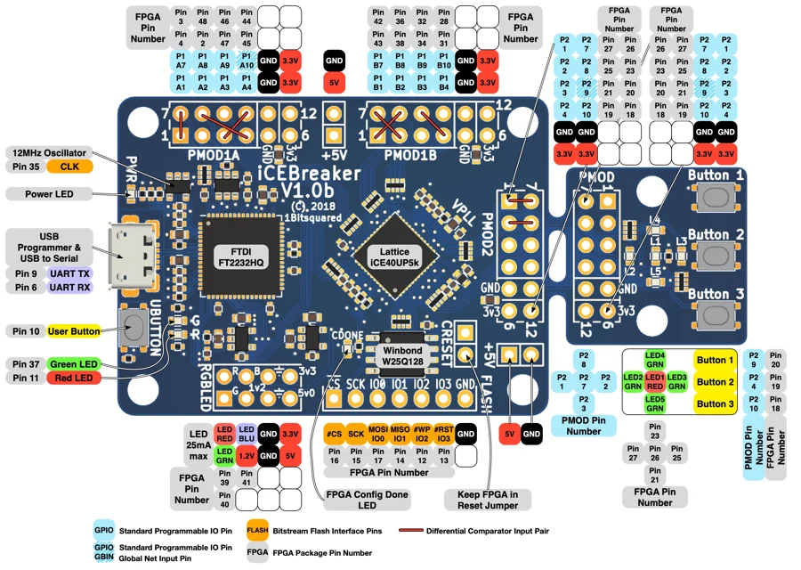

# iCEBreaker v1.0b

**1BitSquared** · iCE40UP5K

Revision: v1.0b

Coverage: Physical pinout source collected; scope and revision require confirmation

[Browse all manufacturers](../../../../BROWSE.md) · [Devices & IoT](../../../../DEVICES.md) · [Open in the browser guide](https://valleytech-black-wire-guide.pages.dev/?board=1bitsquared-icebreaker-v1-0b)

Architecture: **FPGA**

## Specifications and hardware documentation

- [Specifications & hardware guide](https://docs.icebreaker-fpga.org/hardware/icebreaker/)

## Manufacturer board pinout

**pinout image** · Reviewed source · JPG

[Open original reference](../../../../library/media/dd2350c2981919998be31a64998f63782e943e680d7e76426be6cd4cf8789737.jpg)

**Credit and rights:** 1BitSquared / original diagram contributors. Rights not established for this asset; attribution retained. Original artwork is not covered by Black Wire's editorial license.. Source/manufacturer: 1BitSquared.

[Source 1](https://docs.icebreaker-fpga.org/assets/img/icebreaker/icebreaker-v1_0b-legend.jpg) · [Source 2](https://docs.icebreaker-fpga.org/hardware/icebreaker/)

Original publisher reference. Exact board/revision and electrical limits still require confirmation.

Image revision: v1.0b

SHA-256: `dd2350c2981919998be31a64998f63782e943e680d7e76426be6cd4cf8789737`

Pin assignments have not been independently electrically verified. Check board revision before wiring.
