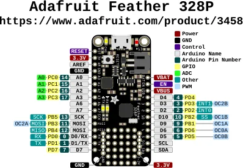

# Feather 328P

**Adafruit** · ATmega328P

Revision: Not identified

Coverage: Physical pinout source collected; scope and revision require confirmation

[Browse all manufacturers](../../../../BROWSE.md) · [Devices & IoT](../../../../DEVICES.md) · [Open in the browser guide](https://valleytech-black-wire-guide.pages.dev/?board=adafruit-feather-328p)

Architecture: **AVR**

## Specifications and hardware documentation

- [Specifications & hardware guide](https://www.adafruit.com/product/3458)

## Original manufacturer graphical reference (PDF)

**original reference PDF** · Reviewed source · PDF

[Open original reference](../../../../library/media/bbe200eee911a5e39ec57305b222a7f7a4be1b4cd1e5cc81ffb2bb73a83397a3.pdf)

**Credit and rights:** Adafruit / original diagram contributors. Rights not established for this asset; attribution retained. Original artwork is not covered by Black Wire's editorial license.. Source/manufacturer: Adafruit.

[Source 1](https://raw.githubusercontent.com/adafruit/Adafruit-Feather-328P-PCB/62859c243921da2d1221681373356f1559855cbc/Adafruit%20Feather%20328P%20Pinout.pdf) · [Source 2](https://www.adafruit.com/product/3458) · [Source 3](https://github.com/adafruit/Adafruit-Feather-328P-PCB/tree/62859c243921da2d1221681373356f1559855cbc)

Original publisher reference. Exact board/revision and electrical limits still require confirmation.

Image revision: Not identified

SHA-256: `bbe200eee911a5e39ec57305b222a7f7a4be1b4cd1e5cc81ffb2bb73a83397a3`

## Manufacturer board pinout — page 1

**pinout image** · Reviewed source · PNG

[Open original reference](../../../../library/media/14fc1acdfb2733b4beef9c92c1b8947aaf14cb3ea1950b3692e0b4aaefb459a3.png)

**Credit and rights:** Adafruit / original diagram contributors. Rights not established for this asset; attribution retained. Original artwork is not covered by Black Wire's editorial license.. Source/manufacturer: Adafruit.

[Source 1](https://raw.githubusercontent.com/adafruit/Adafruit-Feather-328P-PCB/62859c243921da2d1221681373356f1559855cbc/Adafruit%20Feather%20328P%20Pinout.pdf) · [Source 2](https://www.adafruit.com/product/3458) · [Source 3](https://github.com/adafruit/Adafruit-Feather-328P-PCB/tree/62859c243921da2d1221681373356f1559855cbc)

Original publisher reference. Exact board/revision and electrical limits still require confirmation.  PDF page rendered at 144 dpi without changing labels. Original vector PDF retained.

Image revision: Not identified

SHA-256: `14fc1acdfb2733b4beef9c92c1b8947aaf14cb3ea1950b3692e0b4aaefb459a3`

Pin assignments have not been independently electrically verified. Check board revision before wiring.
