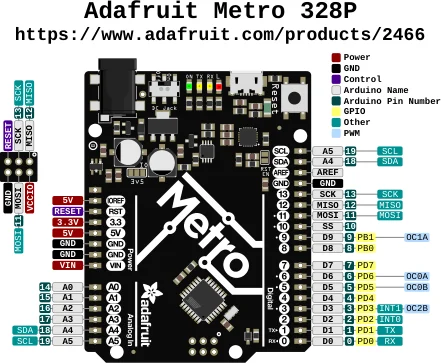

# Metro 328P

**Adafruit** · ATmega328P

Revision: Not identified

Coverage: Physical pinout source collected; scope and revision require confirmation

[Browse all manufacturers](../../../../BROWSE.md) · [Devices & IoT](../../../../DEVICES.md) · [Open in the browser guide](https://valleytech-black-wire-guide.pages.dev/?board=adafruit-metro-328p)

Architecture: **AVR**

## Specifications and hardware documentation

- [Specifications & hardware guide](https://www.adafruit.com/product/2466)

## Original manufacturer graphical reference (PDF)

**original reference PDF** · Reviewed source · PDF

[Open original reference](../../../../library/media/8cb779c6ee0538f70694db19c15c5b424cf445864841a67cbbf82fee5078018e.pdf)

**Credit and rights:** Adafruit / original diagram contributors. Rights not established for this asset; attribution retained. Original artwork is not covered by Black Wire's editorial license.. Source/manufacturer: Adafruit.

[Source 1](https://raw.githubusercontent.com/adafruit/Adafruit-METRO-328-PCB/1d635d70533c446c925ec77240370cfee4fba7ad/Adafruit%20Metro%20328P%20Pinout.pdf) · [Source 2](https://www.adafruit.com/product/2466) · [Source 3](https://github.com/adafruit/Adafruit-METRO-328-PCB/tree/1d635d70533c446c925ec77240370cfee4fba7ad)

Original publisher reference. Exact board/revision and electrical limits still require confirmation.

Image revision: Not identified

SHA-256: `8cb779c6ee0538f70694db19c15c5b424cf445864841a67cbbf82fee5078018e`

## Manufacturer board pinout — page 1

**pinout image** · Reviewed source · PNG

[Open original reference](../../../../library/media/a38655bda11fd66fe578dfa580ab46fdb864e053d9b07b9975b655cbb8febfa7.png)

**Credit and rights:** Adafruit / original diagram contributors. Rights not established for this asset; attribution retained. Original artwork is not covered by Black Wire's editorial license.. Source/manufacturer: Adafruit.

[Source 1](https://raw.githubusercontent.com/adafruit/Adafruit-METRO-328-PCB/1d635d70533c446c925ec77240370cfee4fba7ad/Adafruit%20Metro%20328P%20Pinout.pdf) · [Source 2](https://www.adafruit.com/product/2466) · [Source 3](https://github.com/adafruit/Adafruit-METRO-328-PCB/tree/1d635d70533c446c925ec77240370cfee4fba7ad)

Original publisher reference. Exact board/revision and electrical limits still require confirmation.  PDF page rendered at 144 dpi without changing labels. Original vector PDF retained.

Image revision: Not identified

SHA-256: `a38655bda11fd66fe578dfa580ab46fdb864e053d9b07b9975b655cbb8febfa7`

Pin assignments have not been independently electrically verified. Check board revision before wiring.
