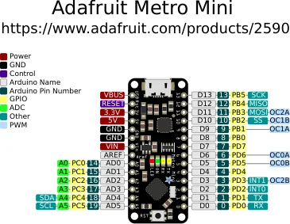

# Metro Mini (legacy)

**Adafruit** · ATmega328P

Revision: Legacy Mini layout, not the current V2

Coverage: Physical pinout source collected; scope and revision require confirmation

[Browse all manufacturers](../../../../BROWSE.md) · [Devices & IoT](../../../../DEVICES.md) · [Open in the browser guide](https://valleytech-black-wire-guide.pages.dev/?board=adafruit-metro-mini)

Architecture: **AVR**

## Specifications and hardware documentation

- [Current product specifications (V2 differs from this diagram)](https://www.adafruit.com/product/2590)

## Original manufacturer graphical reference (PDF)

**original reference PDF** · Reviewed source · PDF

[Open original reference](../../../../library/media/21c603f4f330d328cf5bef0d607585ee457874d85d41f122282bf6c55a28cd28.pdf)

**Credit and rights:** Adafruit / original diagram contributors. Rights not established for this asset; attribution retained. Original artwork is not covered by Black Wire's editorial license.. Source/manufacturer: Adafruit.

[Source 1](https://raw.githubusercontent.com/adafruit/Adafruit-METRO-328-PCB/1d635d70533c446c925ec77240370cfee4fba7ad/Adafruit%20Metro%20Mini%20Pinout.pdf) · [Source 2](https://www.adafruit.com/product/2590) · [Source 3](https://github.com/adafruit/Adafruit-METRO-328-PCB/tree/1d635d70533c446c925ec77240370cfee4fba7ad)

Original publisher reference. Exact board/revision and electrical limits still require confirmation. This is the legacy Metro Mini map. The product URL now describes Metro Mini V2; do not apply this diagram to V2 without a revision check.

Image revision: Not identified

SHA-256: `21c603f4f330d328cf5bef0d607585ee457874d85d41f122282bf6c55a28cd28`

## Manufacturer board pinout — page 1

**pinout image** · Reviewed source · PNG

[Open original reference](../../../../library/media/f98edd2eea3f8e09ee99684b26806bddf021eeeaf8201e30d966f6e300dd3c61.png)

**Credit and rights:** Adafruit / original diagram contributors. Rights not established for this asset; attribution retained. Original artwork is not covered by Black Wire's editorial license.. Source/manufacturer: Adafruit.

[Source 1](https://raw.githubusercontent.com/adafruit/Adafruit-METRO-328-PCB/1d635d70533c446c925ec77240370cfee4fba7ad/Adafruit%20Metro%20Mini%20Pinout.pdf) · [Source 2](https://www.adafruit.com/product/2590) · [Source 3](https://github.com/adafruit/Adafruit-METRO-328-PCB/tree/1d635d70533c446c925ec77240370cfee4fba7ad)

Original publisher reference. Exact board/revision and electrical limits still require confirmation.  PDF page rendered at 144 dpi without changing labels. Original vector PDF retained. This is the legacy Metro Mini map. The product URL now describes Metro Mini V2; do not apply this diagram to V2 without a revision check.

Image revision: Not identified

SHA-256: `f98edd2eea3f8e09ee99684b26806bddf021eeeaf8201e30d966f6e300dd3c61`

Pin assignments have not been independently electrically verified. Check board revision before wiring.
