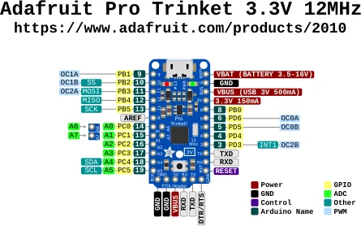

# Pro Trinket 3V

**Adafruit** · ATmega328P

Revision: Not identified

Coverage: Physical pinout source collected; scope and revision require confirmation

[Browse all manufacturers](../../../../BROWSE.md) · [Devices & IoT](../../../../DEVICES.md) · [Open in the browser guide](https://valleytech-black-wire-guide.pages.dev/?board=adafruit-pro-trinket-3v)

Architecture: **AVR**

## Specifications and hardware documentation

- [Specifications & hardware guide](https://www.adafruit.com/product/2010)

## Original manufacturer graphical reference (PDF)

**original reference PDF** · Reviewed source · PDF

[Open original reference](../../../../library/media/f1df9bdc9089e21edc565650dfca83d9af5b84769721b17e4771757248b8a2bb.pdf)

**Credit and rights:** Adafruit / original diagram contributors. Rights not established for this asset; attribution retained. Original artwork is not covered by Black Wire's editorial license.. Source/manufacturer: Adafruit.

[Source 1](https://raw.githubusercontent.com/adafruit/Adafruit-Pro-Trinket-PCBs/8b181a70f0e2f6ba9ef7d983176a14ac0cc9c31a/Adafruit_Pro_Trinket_3V_Pinout.pdf) · [Source 2](https://www.adafruit.com/product/2010) · [Source 3](https://github.com/adafruit/Adafruit-Pro-Trinket-PCBs/tree/8b181a70f0e2f6ba9ef7d983176a14ac0cc9c31a)

Original publisher reference. Exact board/revision and electrical limits still require confirmation.

Image revision: Not identified

SHA-256: `f1df9bdc9089e21edc565650dfca83d9af5b84769721b17e4771757248b8a2bb`

## Manufacturer board pinout — page 1

**pinout image** · Reviewed source · PNG

[Open original reference](../../../../library/media/6c1784e264ce6cbac50f3b98aab8f55903c3e061f158aa4c367a2f100078156a.png)

**Credit and rights:** Adafruit / original diagram contributors. Rights not established for this asset; attribution retained. Original artwork is not covered by Black Wire's editorial license.. Source/manufacturer: Adafruit.

[Source 1](https://raw.githubusercontent.com/adafruit/Adafruit-Pro-Trinket-PCBs/8b181a70f0e2f6ba9ef7d983176a14ac0cc9c31a/Adafruit_Pro_Trinket_3V_Pinout.pdf) · [Source 2](https://www.adafruit.com/product/2010) · [Source 3](https://github.com/adafruit/Adafruit-Pro-Trinket-PCBs/tree/8b181a70f0e2f6ba9ef7d983176a14ac0cc9c31a)

Original publisher reference. Exact board/revision and electrical limits still require confirmation.  PDF page rendered at 144 dpi without changing labels. Original vector PDF retained.

Image revision: Not identified

SHA-256: `6c1784e264ce6cbac50f3b98aab8f55903c3e061f158aa4c367a2f100078156a`

Pin assignments have not been independently electrically verified. Check board revision before wiring.
