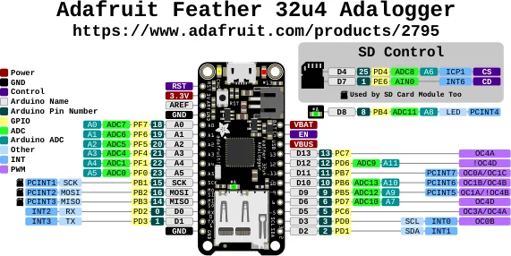

# Feather 32u4 Adalogger

**Adafruit** · ATmega32U4

Revision: Not identified

Coverage: Physical pinout source collected; scope and revision require confirmation

[Browse all manufacturers](../../../../BROWSE.md) · [Devices & IoT](../../../../DEVICES.md) · [Open in the browser guide](https://valleytech-black-wire-guide.pages.dev/?board=adafruit-feather-32u4-adalogger)

Architecture: **AVR**

## Specifications and hardware documentation

- [Specifications & hardware guide](https://www.adafruit.com/product/2795)

## Original manufacturer graphical reference (PDF)

**original reference PDF** · Reviewed source · PDF

[Open original reference](../../../../library/media/814d81dad6f3a69737d71540301134098cc6f4015cb934ea45304e399595143e.pdf)

**Credit and rights:** Adafruit / original diagram contributors. Rights not established for this asset; attribution retained. Original artwork is not covered by Black Wire's editorial license.. Source/manufacturer: Adafruit.

[Source 1](https://raw.githubusercontent.com/adafruit/Adafruit-Feather-32u4-Adalogger-PCB/c7e87d6e0feb5d3e048c3715038c0e4ce71cdfa0/Adafruit%20Feather%2032u4%20Adalogger%20Pinout.pdf) · [Source 2](https://www.adafruit.com/product/2795) · [Source 3](https://github.com/adafruit/Adafruit-Feather-32u4-Adalogger-PCB/tree/c7e87d6e0feb5d3e048c3715038c0e4ce71cdfa0)

Original publisher reference. Exact board/revision and electrical limits still require confirmation.

Image revision: Not identified

SHA-256: `814d81dad6f3a69737d71540301134098cc6f4015cb934ea45304e399595143e`

## Manufacturer board pinout — page 1

**pinout image** · Reviewed source · PNG

[Open original reference](../../../../library/media/fd18fda11b819e3d1619ab870cb8f505ac2497ada38974000bef3b6c1183b8ad.png)

**Credit and rights:** Adafruit / original diagram contributors. Rights not established for this asset; attribution retained. Original artwork is not covered by Black Wire's editorial license.. Source/manufacturer: Adafruit.

[Source 1](https://raw.githubusercontent.com/adafruit/Adafruit-Feather-32u4-Adalogger-PCB/c7e87d6e0feb5d3e048c3715038c0e4ce71cdfa0/Adafruit%20Feather%2032u4%20Adalogger%20Pinout.pdf) · [Source 2](https://www.adafruit.com/product/2795) · [Source 3](https://github.com/adafruit/Adafruit-Feather-32u4-Adalogger-PCB/tree/c7e87d6e0feb5d3e048c3715038c0e4ce71cdfa0)

Original publisher reference. Exact board/revision and electrical limits still require confirmation.  PDF page rendered at 144 dpi without changing labels. Original vector PDF retained.

Image revision: Not identified

SHA-256: `fd18fda11b819e3d1619ab870cb8f505ac2497ada38974000bef3b6c1183b8ad`

Pin assignments have not been independently electrically verified. Check board revision before wiring.
