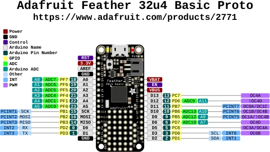

# Feather 32u4 Basic Proto

**Adafruit** · ATmega32U4

Revision: Not identified

Coverage: Physical pinout source collected; scope and revision require confirmation

[Browse all manufacturers](../../../../BROWSE.md) · [Devices & IoT](../../../../DEVICES.md) · [Open in the browser guide](https://valleytech-black-wire-guide.pages.dev/?board=adafruit-feather-32u4-basic-proto)

Architecture: **AVR**

## Specifications and hardware documentation

- [Specifications & hardware guide](https://www.adafruit.com/product/2771)

## Original manufacturer graphical reference (PDF)

**original reference PDF** · Reviewed source · PDF

[Open original reference](../../../../library/media/947c55b9ee6ec222f8b0e75cef114b7432fc89a2b9e1f6ba104481c205d02e58.pdf)

**Credit and rights:** Adafruit / original diagram contributors. Rights not established for this asset; attribution retained. Original artwork is not covered by Black Wire's editorial license.. Source/manufacturer: Adafruit.

[Source 1](https://raw.githubusercontent.com/adafruit/Adafruit-Feather-32u4-Basic-Proto-PCB/42d06b39d8afeb23881364d3a9fabe1cc80b6dd5/Adafruit%20Feather%2032u4%20Basic%20Proto%20Pinout.pdf) · [Source 2](https://www.adafruit.com/product/2771) · [Source 3](https://github.com/adafruit/Adafruit-Feather-32u4-Basic-Proto-PCB/tree/42d06b39d8afeb23881364d3a9fabe1cc80b6dd5)

Original publisher reference. Exact board/revision and electrical limits still require confirmation.

Image revision: Not identified

SHA-256: `947c55b9ee6ec222f8b0e75cef114b7432fc89a2b9e1f6ba104481c205d02e58`

## Manufacturer board pinout — page 1

**pinout image** · Reviewed source · PNG

[Open original reference](../../../../library/media/77f13ef59f33d525305694499834e7e1654a7f6fc16ebfe02ba4f3371a78c727.png)

**Credit and rights:** Adafruit / original diagram contributors. Rights not established for this asset; attribution retained. Original artwork is not covered by Black Wire's editorial license.. Source/manufacturer: Adafruit.

[Source 1](https://raw.githubusercontent.com/adafruit/Adafruit-Feather-32u4-Basic-Proto-PCB/42d06b39d8afeb23881364d3a9fabe1cc80b6dd5/Adafruit%20Feather%2032u4%20Basic%20Proto%20Pinout.pdf) · [Source 2](https://www.adafruit.com/product/2771) · [Source 3](https://github.com/adafruit/Adafruit-Feather-32u4-Basic-Proto-PCB/tree/42d06b39d8afeb23881364d3a9fabe1cc80b6dd5)

Original publisher reference. Exact board/revision and electrical limits still require confirmation.  PDF page rendered at 144 dpi without changing labels. Original vector PDF retained.

Image revision: Not identified

SHA-256: `77f13ef59f33d525305694499834e7e1654a7f6fc16ebfe02ba4f3371a78c727`

Pin assignments have not been independently electrically verified. Check board revision before wiring.
