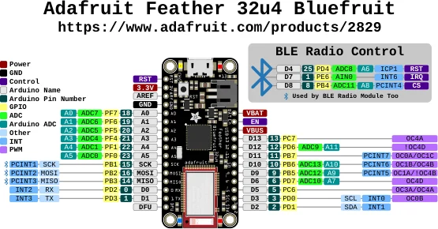

# Feather 32u4 Bluefruit LE

**Adafruit** · ATmega32U4

Revision: Not identified

Coverage: Physical pinout source collected; scope and revision require confirmation

[Browse all manufacturers](../../../../BROWSE.md) · [Devices & IoT](../../../../DEVICES.md) · [Open in the browser guide](https://valleytech-black-wire-guide.pages.dev/?board=adafruit-feather-32u4-bluefruit-le)

Architecture: **AVR**

## Specifications and hardware documentation

- [Specifications & hardware guide](https://www.adafruit.com/product/2829)

## Original manufacturer graphical reference (PDF)

**original reference PDF** · Reviewed source · PDF

[Open original reference](../../../../library/media/86107660043cb7f3d4ebd1614258d62c60f03351fbfc44952699a078c386cb0d.pdf)

**Credit and rights:** Adafruit / original diagram contributors. Rights not established for this asset; attribution retained. Original artwork is not covered by Black Wire's editorial license.. Source/manufacturer: Adafruit.

[Source 1](https://raw.githubusercontent.com/adafruit/Adafruit-Feather-32u4-Bluefruit-LE-PCB/fab08d3f5f0755a29559b81ad54239b746906b56/Adafruit%20Feather%2032u4%20Bluefruit%20LE%20Pinout.pdf) · [Source 2](https://www.adafruit.com/product/2829) · [Source 3](https://github.com/adafruit/Adafruit-Feather-32u4-Bluefruit-LE-PCB/tree/fab08d3f5f0755a29559b81ad54239b746906b56)

Original publisher reference. Exact board/revision and electrical limits still require confirmation.

Image revision: Not identified

SHA-256: `86107660043cb7f3d4ebd1614258d62c60f03351fbfc44952699a078c386cb0d`

## Manufacturer board pinout — page 1

**pinout image** · Reviewed source · PNG

[Open original reference](../../../../library/media/435ef82c9936a6c055455079fb76842df9c0ddfcca0bd9f6b898043018cf790e.png)

**Credit and rights:** Adafruit / original diagram contributors. Rights not established for this asset; attribution retained. Original artwork is not covered by Black Wire's editorial license.. Source/manufacturer: Adafruit.

[Source 1](https://raw.githubusercontent.com/adafruit/Adafruit-Feather-32u4-Bluefruit-LE-PCB/fab08d3f5f0755a29559b81ad54239b746906b56/Adafruit%20Feather%2032u4%20Bluefruit%20LE%20Pinout.pdf) · [Source 2](https://www.adafruit.com/product/2829) · [Source 3](https://github.com/adafruit/Adafruit-Feather-32u4-Bluefruit-LE-PCB/tree/fab08d3f5f0755a29559b81ad54239b746906b56)

Original publisher reference. Exact board/revision and electrical limits still require confirmation.  PDF page rendered at 144 dpi without changing labels. Original vector PDF retained.

Image revision: Not identified

SHA-256: `435ef82c9936a6c055455079fb76842df9c0ddfcca0bd9f6b898043018cf790e`

Pin assignments have not been independently electrically verified. Check board revision before wiring.
