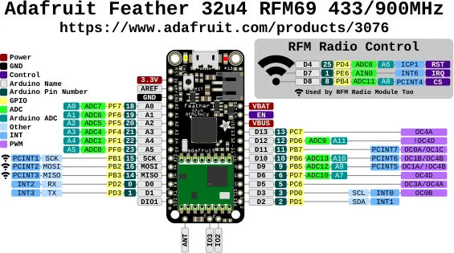

# Feather 32u4 RFM69

**Adafruit** · ATmega32U4

Revision: Not identified

Coverage: Physical pinout source collected; scope and revision require confirmation

[Browse all manufacturers](../../../../BROWSE.md) · [Devices & IoT](../../../../DEVICES.md) · [Open in the browser guide](https://valleytech-black-wire-guide.pages.dev/?board=adafruit-feather-32u4-rfm69)

Architecture: **AVR**

## Specifications and hardware documentation

- [Specifications & hardware guide](https://www.adafruit.com/product/3076)

## Original manufacturer graphical reference (PDF)

**original reference PDF** · Reviewed source · PDF

[Open original reference](../../../../library/media/59abc42bb1b95847ab55ce88d69959ee691d22f52cd2d9ec173850d779199559.pdf)

**Credit and rights:** Adafruit / original diagram contributors. Rights not established for this asset; attribution retained. Original artwork is not covered by Black Wire's editorial license.. Source/manufacturer: Adafruit.

[Source 1](https://raw.githubusercontent.com/adafruit/Adafruit-Feather-32u4-RFM-LoRa-PCB/ace22faec73dda4b8dcfec16e1667551456689dd/Adafruit%20Feather%2032u4%20RFM69%20Pinout.pdf) · [Source 2](https://www.adafruit.com/product/3076) · [Source 3](https://github.com/adafruit/Adafruit-Feather-32u4-RFM-LoRa-PCB/tree/ace22faec73dda4b8dcfec16e1667551456689dd)

Original publisher reference. Exact board/revision and electrical limits still require confirmation.

Image revision: Not identified

SHA-256: `59abc42bb1b95847ab55ce88d69959ee691d22f52cd2d9ec173850d779199559`

## Manufacturer board pinout — page 1

**pinout image** · Reviewed source · PNG

[Open original reference](../../../../library/media/2e2247221bd20a54c61ff8c526651b6a32a36bb3264fb6bc6f3698dec18c8728.png)

**Credit and rights:** Adafruit / original diagram contributors. Rights not established for this asset; attribution retained. Original artwork is not covered by Black Wire's editorial license.. Source/manufacturer: Adafruit.

[Source 1](https://raw.githubusercontent.com/adafruit/Adafruit-Feather-32u4-RFM-LoRa-PCB/ace22faec73dda4b8dcfec16e1667551456689dd/Adafruit%20Feather%2032u4%20RFM69%20Pinout.pdf) · [Source 2](https://www.adafruit.com/product/3076) · [Source 3](https://github.com/adafruit/Adafruit-Feather-32u4-RFM-LoRa-PCB/tree/ace22faec73dda4b8dcfec16e1667551456689dd)

Original publisher reference. Exact board/revision and electrical limits still require confirmation.  PDF page rendered at 144 dpi without changing labels. Original vector PDF retained.

Image revision: Not identified

SHA-256: `2e2247221bd20a54c61ff8c526651b6a32a36bb3264fb6bc6f3698dec18c8728`

Pin assignments have not been independently electrically verified. Check board revision before wiring.
