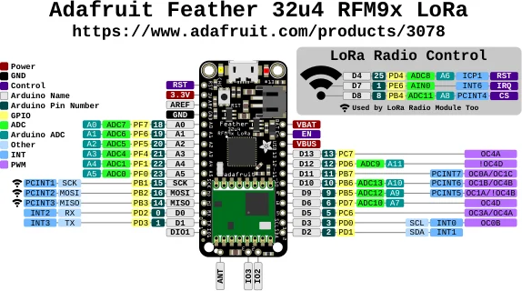

# Feather 32u4 RFM9x

**Adafruit** · ATmega32U4

Revision: Not identified

Coverage: Physical pinout source collected; scope and revision require confirmation

[Browse all manufacturers](../../../../BROWSE.md) · [Devices & IoT](../../../../DEVICES.md) · [Open in the browser guide](https://valleytech-black-wire-guide.pages.dev/?board=adafruit-feather-32u4-rfm9x)

Architecture: **AVR**

## Specifications and hardware documentation

- [Specifications & hardware guide](https://www.adafruit.com/product/3078)

## Original manufacturer graphical reference (PDF)

**original reference PDF** · Reviewed source · PDF

[Open original reference](../../../../library/media/f700361eb51e40ab64c9247f1913ddf96f4ff64245dafa8c235aa3fa16c4db60.pdf)

**Credit and rights:** Adafruit / original diagram contributors. Rights not established for this asset; attribution retained. Original artwork is not covered by Black Wire's editorial license.. Source/manufacturer: Adafruit.

[Source 1](https://raw.githubusercontent.com/adafruit/Adafruit-Feather-32u4-RFM-LoRa-PCB/ace22faec73dda4b8dcfec16e1667551456689dd/Adafruit%20Feather%2032u4%20RFM9x%20Pinout.pdf) · [Source 2](https://www.adafruit.com/product/3078) · [Source 3](https://github.com/adafruit/Adafruit-Feather-32u4-RFM-LoRa-PCB/tree/ace22faec73dda4b8dcfec16e1667551456689dd)

Original publisher reference. Exact board/revision and electrical limits still require confirmation.

Image revision: Not identified

SHA-256: `f700361eb51e40ab64c9247f1913ddf96f4ff64245dafa8c235aa3fa16c4db60`

## Manufacturer board pinout — page 1

**pinout image** · Reviewed source · PNG

[Open original reference](../../../../library/media/dc450dbeb1de7e64340e29422c1e36844d08f89a96b4b043baee7122876a6c31.png)

**Credit and rights:** Adafruit / original diagram contributors. Rights not established for this asset; attribution retained. Original artwork is not covered by Black Wire's editorial license.. Source/manufacturer: Adafruit.

[Source 1](https://raw.githubusercontent.com/adafruit/Adafruit-Feather-32u4-RFM-LoRa-PCB/ace22faec73dda4b8dcfec16e1667551456689dd/Adafruit%20Feather%2032u4%20RFM9x%20Pinout.pdf) · [Source 2](https://www.adafruit.com/product/3078) · [Source 3](https://github.com/adafruit/Adafruit-Feather-32u4-RFM-LoRa-PCB/tree/ace22faec73dda4b8dcfec16e1667551456689dd)

Original publisher reference. Exact board/revision and electrical limits still require confirmation.  PDF page rendered at 144 dpi without changing labels. Original vector PDF retained.

Image revision: Not identified

SHA-256: `dc450dbeb1de7e64340e29422c1e36844d08f89a96b4b043baee7122876a6c31`

Pin assignments have not been independently electrically verified. Check board revision before wiring.
