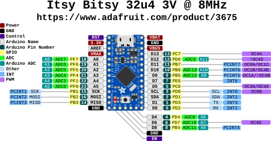

# Itsy Bitsy 32u4 3V

**Adafruit** · ATmega32U4

Revision: Not identified

Coverage: Physical pinout source collected; scope and revision require confirmation

[Browse all manufacturers](../../../../BROWSE.md) · [Devices & IoT](../../../../DEVICES.md) · [Open in the browser guide](https://valleytech-black-wire-guide.pages.dev/?board=adafruit-itsy-bitsy-32u4-3v)

Architecture: **AVR**

## Specifications and hardware documentation

- [Specifications & hardware guide](https://www.adafruit.com/product/3675)

## Original manufacturer graphical reference (PDF)

**original reference PDF** · Reviewed source · PDF

[Open original reference](../../../../library/media/b7260a7671726338cf7d4fd1efda03d1c343400a68d3460d55594b89c5522b3e.pdf)

**Credit and rights:** Adafruit / original diagram contributors. Rights not established for this asset; attribution retained. Original artwork is not covered by Black Wire's editorial license.. Source/manufacturer: Adafruit.

[Source 1](https://raw.githubusercontent.com/adafruit/Adafruit-ItsyBitsy-32u4-PCB/b48fb1454afa84d1d83d4641d6c31fb49d360222/Itsy%20Bitsy%2032u4%203V%20Pinout.pdf) · [Source 2](https://www.adafruit.com/product/3675) · [Source 3](https://github.com/adafruit/Adafruit-ItsyBitsy-32u4-PCB/tree/b48fb1454afa84d1d83d4641d6c31fb49d360222)

Original publisher reference. Exact board/revision and electrical limits still require confirmation.

Image revision: Not identified

SHA-256: `b7260a7671726338cf7d4fd1efda03d1c343400a68d3460d55594b89c5522b3e`

## Manufacturer board pinout — page 1

**pinout image** · Reviewed source · PNG

[Open original reference](../../../../library/media/0bed01a2433f393725e7bddb6fb685b24bd440e6d634be362cf6679387ab607f.png)

**Credit and rights:** Adafruit / original diagram contributors. Rights not established for this asset; attribution retained. Original artwork is not covered by Black Wire's editorial license.. Source/manufacturer: Adafruit.

[Source 1](https://raw.githubusercontent.com/adafruit/Adafruit-ItsyBitsy-32u4-PCB/b48fb1454afa84d1d83d4641d6c31fb49d360222/Itsy%20Bitsy%2032u4%203V%20Pinout.pdf) · [Source 2](https://www.adafruit.com/product/3675) · [Source 3](https://github.com/adafruit/Adafruit-ItsyBitsy-32u4-PCB/tree/b48fb1454afa84d1d83d4641d6c31fb49d360222)

Original publisher reference. Exact board/revision and electrical limits still require confirmation.  PDF page rendered at 144 dpi without changing labels. Original vector PDF retained.

Image revision: Not identified

SHA-256: `0bed01a2433f393725e7bddb6fb685b24bd440e6d634be362cf6679387ab607f`

Pin assignments have not been independently electrically verified. Check board revision before wiring.
