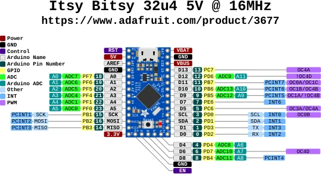

# Itsy Bitsy 32u4 5V

**Adafruit** · ATmega32U4

Revision: Not identified

Coverage: Physical pinout source collected; scope and revision require confirmation

[Browse all manufacturers](../../../../BROWSE.md) · [Devices & IoT](../../../../DEVICES.md) · [Open in the browser guide](https://valleytech-black-wire-guide.pages.dev/?board=adafruit-itsy-bitsy-32u4-5v)

Architecture: **AVR**

## Specifications and hardware documentation

- [Specifications & hardware guide](https://www.adafruit.com/product/3677)

## Original manufacturer graphical reference (PDF)

**original reference PDF** · Reviewed source · PDF

[Open original reference](../../../../library/media/46ad6766e821c69dc6b6e3ed1509a4c7d6fdbfcdc3463e662651496cc4e30f73.pdf)

**Credit and rights:** Adafruit / original diagram contributors. Rights not established for this asset; attribution retained. Original artwork is not covered by Black Wire's editorial license.. Source/manufacturer: Adafruit.

[Source 1](https://raw.githubusercontent.com/adafruit/Adafruit-ItsyBitsy-32u4-PCB/b48fb1454afa84d1d83d4641d6c31fb49d360222/Itsy%20Bitsy%2032u4%205V%20Pinout.pdf) · [Source 2](https://www.adafruit.com/product/3677) · [Source 3](https://github.com/adafruit/Adafruit-ItsyBitsy-32u4-PCB/tree/b48fb1454afa84d1d83d4641d6c31fb49d360222)

Original publisher reference. Exact board/revision and electrical limits still require confirmation.

Image revision: Not identified

SHA-256: `46ad6766e821c69dc6b6e3ed1509a4c7d6fdbfcdc3463e662651496cc4e30f73`

## Manufacturer board pinout — page 1

**pinout image** · Reviewed source · PNG

[Open original reference](../../../../library/media/11787af2873034a7c5c6573c931b1c6825d06ef5deb2d938aa1006e210e9c889.png)

**Credit and rights:** Adafruit / original diagram contributors. Rights not established for this asset; attribution retained. Original artwork is not covered by Black Wire's editorial license.. Source/manufacturer: Adafruit.

[Source 1](https://raw.githubusercontent.com/adafruit/Adafruit-ItsyBitsy-32u4-PCB/b48fb1454afa84d1d83d4641d6c31fb49d360222/Itsy%20Bitsy%2032u4%205V%20Pinout.pdf) · [Source 2](https://www.adafruit.com/product/3677) · [Source 3](https://github.com/adafruit/Adafruit-ItsyBitsy-32u4-PCB/tree/b48fb1454afa84d1d83d4641d6c31fb49d360222)

Original publisher reference. Exact board/revision and electrical limits still require confirmation.  PDF page rendered at 144 dpi without changing labels. Original vector PDF retained.

Image revision: Not identified

SHA-256: `11787af2873034a7c5c6573c931b1c6825d06ef5deb2d938aa1006e210e9c889`

Pin assignments have not been independently electrically verified. Check board revision before wiring.
