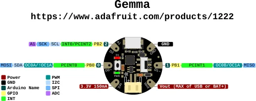

# Gemma

**Adafruit** · ATtiny85

Revision: Not identified

Coverage: Physical pinout source collected; scope and revision require confirmation

[Browse all manufacturers](../../../../BROWSE.md) · [Devices & IoT](../../../../DEVICES.md) · [Open in the browser guide](https://valleytech-black-wire-guide.pages.dev/?board=adafruit-gemma)

Architecture: **AVR**

## Specifications and hardware documentation

- [Specifications & hardware guide](https://www.adafruit.com/product/1222)

## Original manufacturer graphical reference (PDF)

**original reference PDF** · Reviewed source · PDF

[Open original reference](../../../../library/media/b91cb329e34948e8ec844c2ad69333ae71463adc6cd6c379fef406385012ce60.pdf)

**Credit and rights:** Adafruit / original diagram contributors. Rights not established for this asset; attribution retained. Original artwork is not covered by Black Wire's editorial license.. Source/manufacturer: Adafruit.

[Source 1](https://raw.githubusercontent.com/adafruit/Adafruit-Gemma-PCB/88b3cb1a0c9ede216d3a93f904ab7ded9e63daed/Adafruit_Gemma_Pinout.pdf) · [Source 2](https://www.adafruit.com/product/1222) · [Source 3](https://github.com/adafruit/Adafruit-Gemma-PCB/tree/88b3cb1a0c9ede216d3a93f904ab7ded9e63daed)

Original publisher reference. Exact board/revision and electrical limits still require confirmation.

Image revision: Not identified

SHA-256: `b91cb329e34948e8ec844c2ad69333ae71463adc6cd6c379fef406385012ce60`

## Manufacturer board pinout — page 1

**pinout image** · Reviewed source · PNG

[Open original reference](../../../../library/media/075ded35d15516b53daf83656c216f95548f37c5428c6bdf9a459ffb8b38e044.png)

**Credit and rights:** Adafruit / original diagram contributors. Rights not established for this asset; attribution retained. Original artwork is not covered by Black Wire's editorial license.. Source/manufacturer: Adafruit.

[Source 1](https://raw.githubusercontent.com/adafruit/Adafruit-Gemma-PCB/88b3cb1a0c9ede216d3a93f904ab7ded9e63daed/Adafruit_Gemma_Pinout.pdf) · [Source 2](https://www.adafruit.com/product/1222) · [Source 3](https://github.com/adafruit/Adafruit-Gemma-PCB/tree/88b3cb1a0c9ede216d3a93f904ab7ded9e63daed)

Original publisher reference. Exact board/revision and electrical limits still require confirmation.  PDF page rendered at 144 dpi without changing labels. Original vector PDF retained.

Image revision: Not identified

SHA-256: `075ded35d15516b53daf83656c216f95548f37c5428c6bdf9a459ffb8b38e044`

Pin assignments have not been independently electrically verified. Check board revision before wiring.
