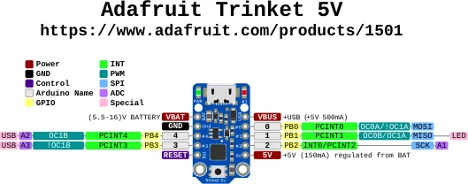

# Trinket 5V

**Adafruit** · ATtiny85

Revision: Not identified

Coverage: Physical pinout source collected; scope and revision require confirmation

[Browse all manufacturers](../../../../BROWSE.md) · [Devices & IoT](../../../../DEVICES.md) · [Open in the browser guide](https://valleytech-black-wire-guide.pages.dev/?board=adafruit-trinket-5v)

Architecture: **AVR**

## Specifications and hardware documentation

- [Specifications & hardware guide](https://www.adafruit.com/product/1501)

## Original manufacturer graphical reference (PDF)

**original reference PDF** · Reviewed source · PDF

[Open original reference](../../../../library/media/68f79a1b8653cfa0ae6806acc5f7c7bfdd78dcbf291909a4f81ab412b2daf76b.pdf)

**Credit and rights:** Adafruit / original diagram contributors. Rights not established for this asset; attribution retained. Original artwork is not covered by Black Wire's editorial license.. Source/manufacturer: Adafruit.

[Source 1](https://raw.githubusercontent.com/adafruit/Adafruit-Trinket-PCB/3a2695463e52f72434d20daca6502fc62e8e2fcc/Adafruit_Trinket_5V_Pinout.pdf) · [Source 2](https://www.adafruit.com/product/1501) · [Source 3](https://github.com/adafruit/Adafruit-Trinket-PCB/tree/3a2695463e52f72434d20daca6502fc62e8e2fcc)

Original publisher reference. Exact board/revision and electrical limits still require confirmation.

Image revision: Not identified

SHA-256: `68f79a1b8653cfa0ae6806acc5f7c7bfdd78dcbf291909a4f81ab412b2daf76b`

## Manufacturer board pinout — page 1

**pinout image** · Reviewed source · PNG

[Open original reference](../../../../library/media/f07c5fb88c433df2ad9d8da8a23b79b4be853051d1e8156fd05b3212608de71a.png)

**Credit and rights:** Adafruit / original diagram contributors. Rights not established for this asset; attribution retained. Original artwork is not covered by Black Wire's editorial license.. Source/manufacturer: Adafruit.

[Source 1](https://raw.githubusercontent.com/adafruit/Adafruit-Trinket-PCB/3a2695463e52f72434d20daca6502fc62e8e2fcc/Adafruit_Trinket_5V_Pinout.pdf) · [Source 2](https://www.adafruit.com/product/1501) · [Source 3](https://github.com/adafruit/Adafruit-Trinket-PCB/tree/3a2695463e52f72434d20daca6502fc62e8e2fcc)

Original publisher reference. Exact board/revision and electrical limits still require confirmation.  PDF page rendered at 144 dpi without changing labels. Original vector PDF retained.

Image revision: Not identified

SHA-256: `f07c5fb88c433df2ad9d8da8a23b79b4be853051d1e8156fd05b3212608de71a`

Pin assignments have not been independently electrically verified. Check board revision before wiring.
