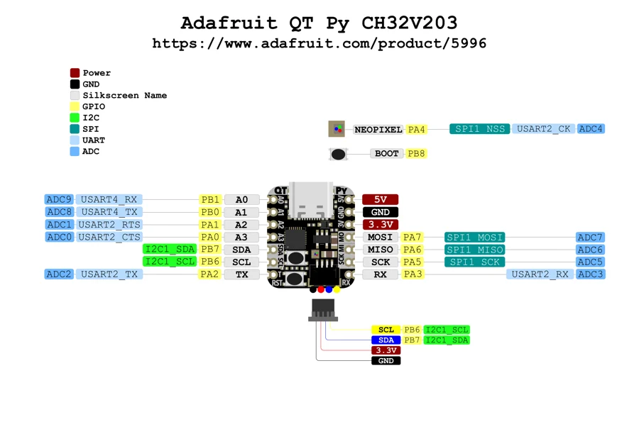

# QT Py CH32V203

**Adafruit** · CH32V203

Revision: Not identified

Coverage: Physical pinout source collected; scope and revision require confirmation

[Browse all manufacturers](../../../../BROWSE.md) · [Devices & IoT](../../../../DEVICES.md) · [Open in the browser guide](https://valleytech-black-wire-guide.pages.dev/?board=adafruit-qt-py-ch32v203)

Architecture: **RISC-V**

## Specifications and hardware documentation

- [Specifications & hardware guide](https://www.adafruit.com/product/5996)

## Original manufacturer graphical reference (PDF)

**original reference PDF** · Reviewed source · PDF

[Open original reference](../../../../library/media/dfd2d44116a38d4e16cd13a67dd39454af30c4269e73049aa7539e0884c48a5f.pdf)

**Credit and rights:** Adafruit / original diagram contributors. Rights not established for this asset; attribution retained. Original artwork is not covered by Black Wire's editorial license.. Source/manufacturer: Adafruit.

[Source 1](https://raw.githubusercontent.com/adafruit/Adafruit-QT-Py-CH32V203-PCB/c5c1580d9823d2f8923778530339179531d024f6/Adafruit%20QT%20Py%20CH32V203%20PrettyPins.pdf) · [Source 2](https://www.adafruit.com/product/5996) · [Source 3](https://github.com/adafruit/Adafruit-QT-Py-CH32V203-PCB/tree/c5c1580d9823d2f8923778530339179531d024f6)

Original publisher reference. Exact board/revision and electrical limits still require confirmation.

Image revision: Not identified

SHA-256: `dfd2d44116a38d4e16cd13a67dd39454af30c4269e73049aa7539e0884c48a5f`

## Manufacturer board pinout — page 1

**pinout image** · Reviewed source · PNG

[Open original reference](../../../../library/media/ea1c3b2f25cc906b21d41f0a25a3ab459ad425b6419ec27158bf0b352f82b888.png)

**Credit and rights:** Adafruit / original diagram contributors. Rights not established for this asset; attribution retained. Original artwork is not covered by Black Wire's editorial license.. Source/manufacturer: Adafruit.

[Source 1](https://raw.githubusercontent.com/adafruit/Adafruit-QT-Py-CH32V203-PCB/c5c1580d9823d2f8923778530339179531d024f6/Adafruit%20QT%20Py%20CH32V203%20PrettyPins.pdf) · [Source 2](https://www.adafruit.com/product/5996) · [Source 3](https://github.com/adafruit/Adafruit-QT-Py-CH32V203-PCB/tree/c5c1580d9823d2f8923778530339179531d024f6)

Original publisher reference. Exact board/revision and electrical limits still require confirmation.  PDF page rendered at 144 dpi without changing labels. Original vector PDF retained.

Image revision: Not identified

SHA-256: `ea1c3b2f25cc906b21d41f0a25a3ab459ad425b6419ec27158bf0b352f82b888`

Pin assignments have not been independently electrically verified. Check board revision before wiring.
