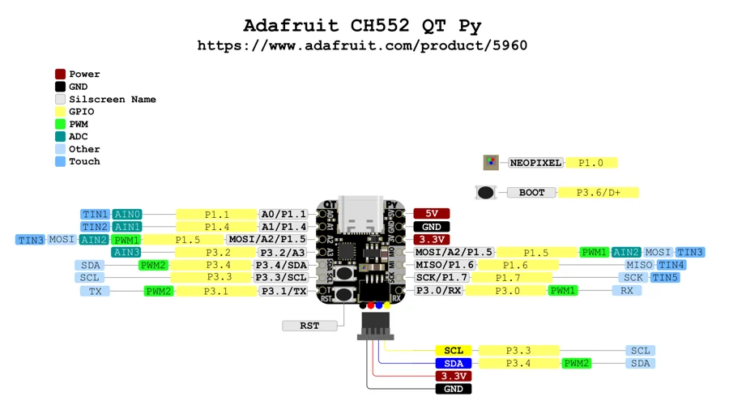

# CH552 QT Py

**Adafruit** · CH552

Revision: Not identified

Coverage: Physical pinout source collected; scope and revision require confirmation

[Browse all manufacturers](../../../../BROWSE.md) · [Devices & IoT](../../../../DEVICES.md) · [Open in the browser guide](https://valleytech-black-wire-guide.pages.dev/?board=adafruit-ch552-qt-py)

## Specifications and hardware documentation

- [Specifications & hardware guide](https://www.adafruit.com/product/5960)

## Original manufacturer graphical reference (PDF)

**original reference PDF** · Reviewed source · PDF

[Open original reference](../../../../library/media/4f9345ab211f5fb490b48ea129494cde8e2df032c01a6746eef2f584b25f9d10.pdf)

**Credit and rights:** Adafruit / original diagram contributors. Rights not established for this asset; attribution retained. Original artwork is not covered by Black Wire's editorial license.. Source/manufacturer: Adafruit.

[Source 1](https://raw.githubusercontent.com/adafruit/Adafruit-CH552-QT-Py-PCB/475a3a83213fda98c1a530a84eb6e167cd187b4b/Adafruit%20CH552%20QT%20Py%20PrettyPins.pdf) · [Source 2](https://www.adafruit.com/product/5960) · [Source 3](https://github.com/adafruit/Adafruit-CH552-QT-Py-PCB/tree/475a3a83213fda98c1a530a84eb6e167cd187b4b)

Original publisher reference. Exact board/revision and electrical limits still require confirmation.

Image revision: Not identified

SHA-256: `4f9345ab211f5fb490b48ea129494cde8e2df032c01a6746eef2f584b25f9d10`

## Manufacturer board pinout — page 1

**pinout image** · Reviewed source · PNG

[Open original reference](../../../../library/media/c5b2f272822969f4b3851be6a7ad38d27757c974cad1fae4ffd52cc8024ccff1.png)

**Credit and rights:** Adafruit / original diagram contributors. Rights not established for this asset; attribution retained. Original artwork is not covered by Black Wire's editorial license.. Source/manufacturer: Adafruit.

[Source 1](https://raw.githubusercontent.com/adafruit/Adafruit-CH552-QT-Py-PCB/475a3a83213fda98c1a530a84eb6e167cd187b4b/Adafruit%20CH552%20QT%20Py%20PrettyPins.pdf) · [Source 2](https://www.adafruit.com/product/5960) · [Source 3](https://github.com/adafruit/Adafruit-CH552-QT-Py-PCB/tree/475a3a83213fda98c1a530a84eb6e167cd187b4b)

Original publisher reference. Exact board/revision and electrical limits still require confirmation.  PDF page rendered at 144 dpi without changing labels. Original vector PDF retained.

Image revision: Not identified

SHA-256: `c5b2f272822969f4b3851be6a7ad38d27757c974cad1fae4ffd52cc8024ccff1`

Pin assignments have not been independently electrically verified. Check board revision before wiring.
