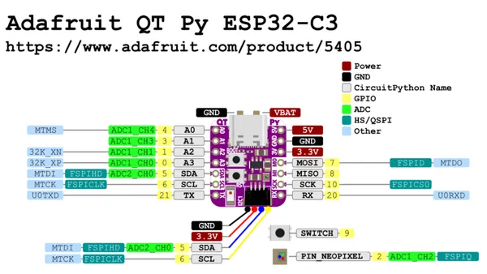

# QT Py ESP32-C3

**Adafruit** · ESP32-C3

Revision: Not identified  
Coverage: Pinout image collected

[Browse all manufacturers](../../../../BROWSE.md) · [Desktop app](https://github.com/valleytechsolutions/black-wire-desktop)

## Pinout reference - PDF page 1

**pinout image** · Reviewed source · PNG

[Open original reference](../../../../library/media/d2db9b2391be28b9b65dd147591c573e645aae152df238bc470ee9b4ffbe5b64.png)

**Credit and rights:** Not established; source attribution retained. Source/manufacturer: Adafruit.

[Source 1](https://raw.githubusercontent.com/adafruit/Adafruit-QT-Py-ESP32-C3-PCB/main/Adafruit QT Py ESP32-C3 Pinout.pdf) · [Source 2](https://learn.adafruit.com/adafruit-qt-py-esp32-c3-wifi-dev-board/pinouts)

 Original PDF page 1 rendered at 220 dpi; no labels changed.

SHA-256: `d2db9b2391be28b9b65dd147591c573e645aae152df238bc470ee9b4ffbe5b64`

## Manufacturer pinout PDF

**original reference PDF** · Reviewed source · PDF

[Open original reference](../../../../library/media/4657609a6ec53674034294921c365ccec9daf04b85382496505c9b046671c429.pdf)

**Credit and rights:** Not established; source attribution retained. Source/manufacturer: Adafruit.

[Source 1](https://raw.githubusercontent.com/adafruit/Adafruit-QT-Py-ESP32-C3-PCB/main/Adafruit QT Py ESP32-C3 Pinout.pdf) · [Source 2](https://learn.adafruit.com/adafruit-qt-py-esp32-c3-wifi-dev-board/pinouts)

SHA-256: `4657609a6ec53674034294921c365ccec9daf04b85382496505c9b046671c429`

Pin assignments have not been independently electrically verified. Check board revision before wiring.
