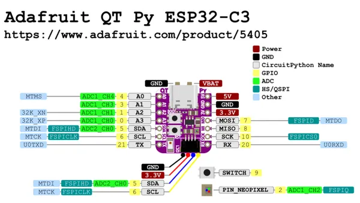

# QT Py ESP32-C3

**Adafruit** · ESP32-C3

Revision: Not identified

Coverage: Pinout image collected

[Browse all manufacturers](../../../../BROWSE.md) · [Devices & IoT](../../../../DEVICES.md) · [Open in the browser guide](https://valleytech-black-wire-guide.pages.dev/?board=adafruit-esp32-qt-py-esp32-c3)

## Datasheets and original documentation

Board datasheet: **not yet recorded**. Visual reference: **available**.

[Manufacturer source (recorded link)](https://learn.adafruit.com/adafruit-qt-py-esp32-c3-wifi-dev-board/pinouts)

A chip datasheet, schematic and board datasheet have different scopes. Match the exact hardware revision.

[Documentation coverage and remaining gaps](../../../../DOCUMENTATION.md)

## Pinout reference - PDF page 1

**pinout image** · Reviewed source · PNG

[Open original reference](../../../../library/media/d2db9b2391be28b9b65dd147591c573e645aae152df238bc470ee9b4ffbe5b64.png)

**Credit and rights:** Not established; source attribution retained. Source/manufacturer: Adafruit.

[Source 1](https://raw.githubusercontent.com/adafruit/Adafruit-QT-Py-ESP32-C3-PCB/main/Adafruit QT Py ESP32-C3 Pinout.pdf) · [Source 2](https://learn.adafruit.com/adafruit-qt-py-esp32-c3-wifi-dev-board/pinouts)

 Original PDF page 1 rendered at 220 dpi; no labels changed.

Image revision: Not identified

SHA-256: `d2db9b2391be28b9b65dd147591c573e645aae152df238bc470ee9b4ffbe5b64`

## Manufacturer pinout PDF

**original reference PDF** · Reviewed source · PDF

[Open original reference](../../../../library/media/4657609a6ec53674034294921c365ccec9daf04b85382496505c9b046671c429.pdf)

**Credit and rights:** Not established; source attribution retained. Source/manufacturer: Adafruit.

[Source 1](https://raw.githubusercontent.com/adafruit/Adafruit-QT-Py-ESP32-C3-PCB/main/Adafruit QT Py ESP32-C3 Pinout.pdf) · [Source 2](https://learn.adafruit.com/adafruit-qt-py-esp32-c3-wifi-dev-board/pinouts)

Image revision: Not identified

SHA-256: `4657609a6ec53674034294921c365ccec9daf04b85382496505c9b046671c429`

Pin assignments have not been independently electrically verified. Check board revision before wiring.
