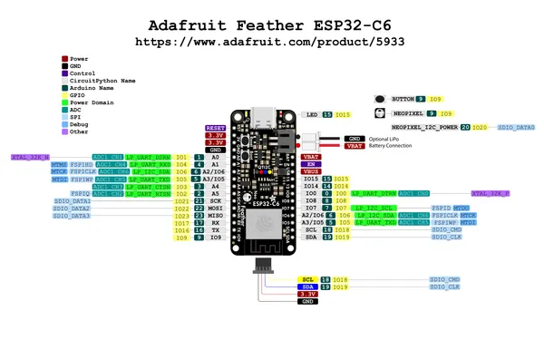

# Feather ESP32-C6 4MB Flash No PSRAM

**Adafruit** · ESP32-C6

Revision: Not identified  
Coverage: Pinout image collected

[Browse all manufacturers](../../../../BROWSE.md) · [Desktop app](https://github.com/valleytechsolutions/black-wire-desktop)

## Pinout reference - PDF page 1

**pinout image** · Reviewed source · PNG

[Open original reference](../../../../library/media/70e2c74c3e745272edc32ad7e3172f9e9d74c5bed936e0ee6d564f0a7f4a59f9.png)

**Credit and rights:** Not established; source attribution retained. Source/manufacturer: Adafruit.

[Source 1](https://raw.githubusercontent.com/adafruit/Adafruit-ESP32-C6-Feather-PCB/main/Adafruit%20Feather%20ESP32-C6%20PrettyPins%202.pdf) · [Source 2](https://learn.adafruit.com/adafruit-esp32-c6-feather/pinouts)

Discovered from CircuitPython board metadata and the linked product/documentation page. Exact hardware revision requires matching to the diagram. Original PDF page 1 rendered at 220 dpi; no labels changed.

SHA-256: `70e2c74c3e745272edc32ad7e3172f9e9d74c5bed936e0ee6d564f0a7f4a59f9`

## Physical board pinout

**original reference PDF** · Reviewed source · PDF

[Open original reference](../../../../library/media/f93ac5623824aff97e18719f70b26921f618154e0c29a8e06f20bc40fbc9e8ab.pdf)

**Credit and rights:** Not established; source attribution retained. Source/manufacturer: Adafruit.

[Source 1](https://raw.githubusercontent.com/adafruit/Adafruit-ESP32-C6-Feather-PCB/main/Adafruit%20Feather%20ESP32-C6%20PrettyPins%202.pdf) · [Source 2](https://learn.adafruit.com/adafruit-esp32-c6-feather/pinouts)

Discovered from CircuitPython board metadata and the linked product/documentation page. Exact hardware revision requires matching to the diagram.

SHA-256: `f93ac5623824aff97e18719f70b26921f618154e0c29a8e06f20bc40fbc9e8ab`

Pin assignments have not been independently electrically verified. Check board revision before wiring.
