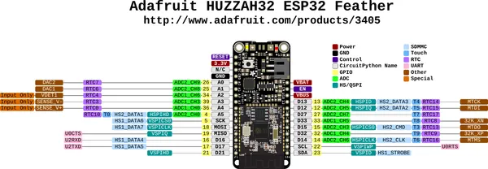

# Adafruit Feather HUZZAH32

**Adafruit** · ESP32 original

Revision: Not identified  
Coverage: Pinout image collected

[Browse all manufacturers](../../../../BROWSE.md) · [Desktop app](https://github.com/valleytechsolutions/black-wire-desktop)

## Pinout reference - PDF page 1

**pinout image** · Reviewed source · PNG

[Open original reference](../../../../library/media/3bf97d2d7de0a863bbf6a14e8c0595f108a3ea6f68a5d8f8f16cce7279ffc6e7.png)

**Credit and rights:** Not established; source attribution retained. Source/manufacturer: Adafruit.

[Source 1](https://raw.githubusercontent.com/adafruit/Adafruit-HUZZAH32-ESP32-Feather-PCB/master/Adafruit%20HUZZAH32%20ESP32%20Feather%20Pinout.pdf) · [Source 2](https://learn.adafruit.com/adafruit-huzzah32-esp32-feather/pinouts)

Discovered from CircuitPython board metadata and the linked product/documentation page. Exact hardware revision requires matching to the diagram. Original PDF page 1 rendered at 220 dpi; no labels changed.

SHA-256: `3bf97d2d7de0a863bbf6a14e8c0595f108a3ea6f68a5d8f8f16cce7279ffc6e7`

## Physical board pinout

**original reference PDF** · Reviewed source · PDF

[Open original reference](../../../../library/media/7bf736651854a04ea2d7293e124e2be86c66ef70c1f0fc3ab47c08c8f07c279b.pdf)

**Credit and rights:** Not established; source attribution retained. Source/manufacturer: Adafruit.

[Source 1](https://raw.githubusercontent.com/adafruit/Adafruit-HUZZAH32-ESP32-Feather-PCB/master/Adafruit%20HUZZAH32%20ESP32%20Feather%20Pinout.pdf) · [Source 2](https://learn.adafruit.com/adafruit-huzzah32-esp32-feather/pinouts)

Discovered from CircuitPython board metadata and the linked product/documentation page. Exact hardware revision requires matching to the diagram.

SHA-256: `7bf736651854a04ea2d7293e124e2be86c66ef70c1f0fc3ab47c08c8f07c279b`

Pin assignments have not been independently electrically verified. Check board revision before wiring.
