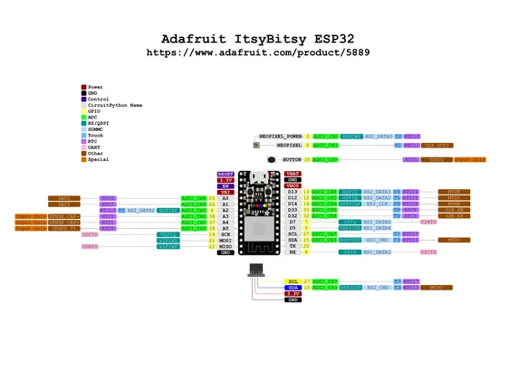

# Adafruit ItsyBitsy ESP32

**Adafruit** · ESP32 original

Revision: Not identified  
Coverage: Pinout image collected

[Browse all manufacturers](../../../../BROWSE.md) · [Desktop app](https://github.com/valleytechsolutions/black-wire-desktop)

## Pinout reference - PDF page 1

**pinout image** · Reviewed source · PNG

[Open original reference](../../../../library/media/954ebeccd0a4d1e4c02c47a3d8facfe9a90c4ce762b2a7ebc44b817ec9657b5f.png)

**Credit and rights:** Not established; source attribution retained. Source/manufacturer: Adafruit.

[Source 1](https://raw.githubusercontent.com/adafruit/Adafruit-ItsyBitsy-ESP32-PCB/main/Adafruit_ItsyBitsy_ESP32_PrettyPinsPDF.pdf) · [Source 2](https://learn.adafruit.com/adafruit-itsybitsy-esp32/pinouts)

Discovered from CircuitPython board metadata and the linked product/documentation page. Exact hardware revision requires matching to the diagram. Original PDF page 1 rendered at 220 dpi; no labels changed.

SHA-256: `954ebeccd0a4d1e4c02c47a3d8facfe9a90c4ce762b2a7ebc44b817ec9657b5f`

## Physical board pinout

**original reference PDF** · Reviewed source · PDF

[Open original reference](../../../../library/media/1bb870aaa08d34808f8529a0ed28e4218e115e39e0c18fa38f92e5155fb8470a.pdf)

**Credit and rights:** Not established; source attribution retained. Source/manufacturer: Adafruit.

[Source 1](https://raw.githubusercontent.com/adafruit/Adafruit-ItsyBitsy-ESP32-PCB/main/Adafruit_ItsyBitsy_ESP32_PrettyPinsPDF.pdf) · [Source 2](https://learn.adafruit.com/adafruit-itsybitsy-esp32/pinouts)

Discovered from CircuitPython board metadata and the linked product/documentation page. Exact hardware revision requires matching to the diagram.

SHA-256: `1bb870aaa08d34808f8529a0ed28e4218e115e39e0c18fa38f92e5155fb8470a`

Pin assignments have not been independently electrically verified. Check board revision before wiring.
