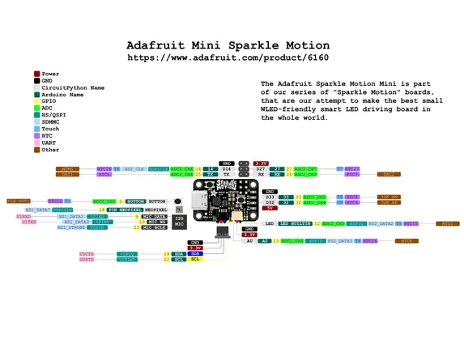

# Adafruit Mini Sparkle Motion

**Adafruit** · ESP32 original

Revision: Not identified  
Coverage: Pinout image collected

[Browse all manufacturers](../../../../BROWSE.md) · [Desktop app](https://github.com/valleytechsolutions/black-wire-desktop)

## Pinout reference - PDF page 1

**pinout image** · Reviewed source · PNG

[Open original reference](../../../../library/media/c53a06cf3b54e6f7298b64938e2b0817a0028bca120c1456d8e1732fbfebc4bb.png)

**Credit and rights:** Not established; source attribution retained. Source/manufacturer: Adafruit.

[Source 1](https://raw.githubusercontent.com/adafruit/Adafruit-Mini-Sparkle-Motion-PCB/main/Adafruit%20Mini%20Sparkle%20Motion%20PrettyPins.pdf) · [Source 2](https://learn.adafruit.com/adafruit-sparkle-motion-mini/pinouts)

Discovered from CircuitPython board metadata and the linked product/documentation page. Exact hardware revision requires matching to the diagram. Original PDF page 1 rendered at 220 dpi; no labels changed.

SHA-256: `c53a06cf3b54e6f7298b64938e2b0817a0028bca120c1456d8e1732fbfebc4bb`

## Physical board pinout

**original reference PDF** · Reviewed source · PDF

[Open original reference](../../../../library/media/a1c4c224ea316810cd4d96efddf5c293528b2384f38a0f7eb828703875e85e7e.pdf)

**Credit and rights:** Not established; source attribution retained. Source/manufacturer: Adafruit.

[Source 1](https://raw.githubusercontent.com/adafruit/Adafruit-Mini-Sparkle-Motion-PCB/main/Adafruit%20Mini%20Sparkle%20Motion%20PrettyPins.pdf) · [Source 2](https://learn.adafruit.com/adafruit-sparkle-motion-mini/pinouts)

Discovered from CircuitPython board metadata and the linked product/documentation page. Exact hardware revision requires matching to the diagram.

SHA-256: `a1c4c224ea316810cd4d96efddf5c293528b2384f38a0f7eb828703875e85e7e`

Pin assignments have not been independently electrically verified. Check board revision before wiring.
