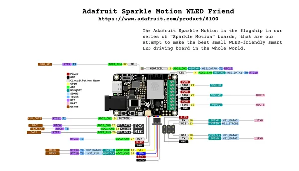

# Adafruit Sparkle Motion

**Adafruit** · ESP32 original

Revision: Not identified

Coverage: Pinout image collected

[Browse all manufacturers](../../../../BROWSE.md) · [Devices & IoT](../../../../DEVICES.md) · [Open in the browser guide](https://valleytech-black-wire-guide.pages.dev/?board=adafruit-esp32-sparkle-motion)

## Pinout reference - PDF page 1

**pinout image** · Reviewed source · PNG

[Open original reference](../../../../library/media/b55962f11eb1102c46f18b4718926079291746cf51b73cdc2267dfd12324b51a.png)

**Credit and rights:** Not established; source attribution retained. Source/manufacturer: Adafruit.

[Source 1](https://raw.githubusercontent.com/adafruit/Adafruit-Sparkle-Motion-PCB/main/Adafruit%20Sparkle%20Motion%20WLED%20Friend%20PrettyPins.pdf) · [Source 2](https://learn.adafruit.com/adafruit-sparkle-motion/pinouts)

Discovered from CircuitPython board metadata and the linked product/documentation page. Exact hardware revision requires matching to the diagram. Page is shared with: Adafruit Sparkle Motion. Original PDF page 1 rendered at 220 dpi; no labels changed.

Image revision: Not identified

SHA-256: `b55962f11eb1102c46f18b4718926079291746cf51b73cdc2267dfd12324b51a`

## Physical board pinout

**original reference PDF** · Reviewed source · PDF

[Open original reference](../../../../library/media/e6f5bc0c5bfa8cd03a65fa639ad419fea826805300a2e748459759e085e613ce.pdf)

**Credit and rights:** Not established; source attribution retained. Source/manufacturer: Adafruit.

[Source 1](https://raw.githubusercontent.com/adafruit/Adafruit-Sparkle-Motion-PCB/main/Adafruit%20Sparkle%20Motion%20WLED%20Friend%20PrettyPins.pdf) · [Source 2](https://learn.adafruit.com/adafruit-sparkle-motion/pinouts)

Discovered from CircuitPython board metadata and the linked product/documentation page. Exact hardware revision requires matching to the diagram. Page is shared with: Adafruit Sparkle Motion.

Image revision: Not identified

SHA-256: `e6f5bc0c5bfa8cd03a65fa639ad419fea826805300a2e748459759e085e613ce`

Pin assignments have not been independently electrically verified. Check board revision before wiring.
