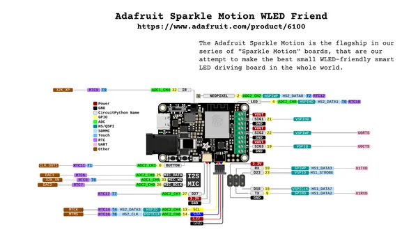
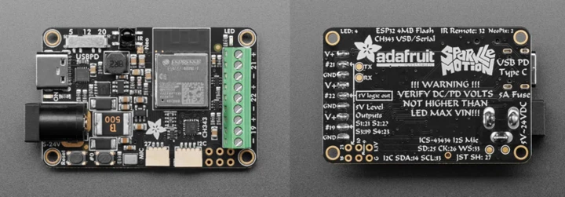
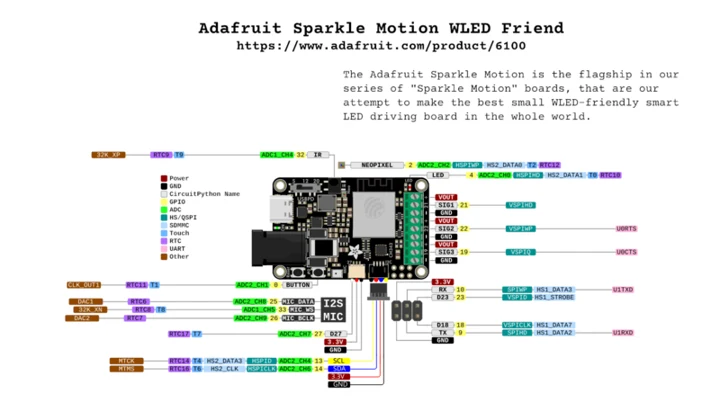

# Adafruit Sparkle Motion

**Adafruit** · ESP32 original

Revision: Not identified

Coverage: Manufacturer references reviewed by scope; independent electrical and all-connector review pending

[Browse all manufacturers](../../../../BROWSE.md) · [Devices & IoT](../../../../DEVICES.md) · [Open in the browser guide](https://valleytech-black-wire-guide.pages.dev/?board=adafruit-esp32-sparkle-motion)

## Datasheets and original documentation

Board datasheet: **not yet recorded**. Visual reference: **available**.

[Manufacturer hardware documentation](https://learn.adafruit.com/adafruit-sparkle-motion/pinouts)

- **hardware-guide / board**: [Manufacturer pin and hardware documentation](https://learn.adafruit.com/adafruit-sparkle-motion/pinouts) · online

A chip datasheet, schematic and board datasheet have different scopes. Match the exact hardware revision.

[Documentation coverage and remaining gaps](../../../../DOCUMENTATION.md)

## Pinout reference - PDF page 1

**pinout image** · Reviewed source · PNG

[Open original reference](../../../../library/media/b55962f11eb1102c46f18b4718926079291746cf51b73cdc2267dfd12324b51a.png)

**Credit and rights:** Not established; source attribution retained. Source/manufacturer: Adafruit.

[Source 1](https://raw.githubusercontent.com/adafruit/Adafruit-Sparkle-Motion-PCB/main/Adafruit%20Sparkle%20Motion%20WLED%20Friend%20PrettyPins.pdf) · [Source 2](https://learn.adafruit.com/adafruit-sparkle-motion/pinouts)

Discovered from CircuitPython board metadata and the linked product/documentation page. Exact hardware revision requires matching to the diagram. Page is shared with: Adafruit Sparkle Motion. Original PDF page 1 rendered at 220 dpi; no labels changed.

Image revision: Not identified

SHA-256: `b55962f11eb1102c46f18b4718926079291746cf51b73cdc2267dfd12324b51a`

## Physical board pinout

**original reference PDF** · Reviewed source · PDF

[Open original reference](../../../../library/media/e6f5bc0c5bfa8cd03a65fa639ad419fea826805300a2e748459759e085e613ce.pdf)

**Credit and rights:** Not established; source attribution retained. Source/manufacturer: Adafruit.

[Source 1](https://raw.githubusercontent.com/adafruit/Adafruit-Sparkle-Motion-PCB/main/Adafruit%20Sparkle%20Motion%20WLED%20Friend%20PrettyPins.pdf) · [Source 2](https://learn.adafruit.com/adafruit-sparkle-motion/pinouts)

Discovered from CircuitPython board metadata and the linked product/documentation page. Exact hardware revision requires matching to the diagram. Page is shared with: Adafruit Sparkle Motion.

Image revision: Not identified

SHA-256: `e6f5bc0c5bfa8cd03a65fa639ad419fea826805300a2e748459759e085e613ce`

## Pinouts

**board labeling image** · Source identity and visual scope inspected; PDF review covers first-page preview. Independent electrical and all-connector completeness review pending. · PNG

[Open original reference](../../../../library/media/5cb52d5701958c8343c0843dc31dba2b95cea381fe83ca65bf6b42fe5c268119.png)

**Credit and rights:** Manufacturer artwork; reuse and print rights not established. Inclusion does not relicense the original.. Source/manufacturer: Adafruit.

[Source 1](https://cdn-learn.adafruit.com/assets/assets/000/134/648/medium800/adafruit_products_sparklemotion_pinouts_frontback.png?1737732738) · [Source 2](https://learn.adafruit.com/adafruit-sparkle-motion/pinouts)

Manufacturer source retained unchanged. Source identity and visual scope inspected; PDF review covers first-page preview. Independent electrical and all-connector completeness review pending. See the linked manufacturer page for the numbered component legend. This is not a complete physical pinout.

Image revision: As supplied in the original; match exact board revision

SHA-256: `5cb52d5701958c8343c0843dc31dba2b95cea381fe83ca65bf6b42fe5c268119`

## Pinouts

**pinout image** · Source identity and visual scope inspected; PDF review covers first-page preview. Independent electrical and all-connector completeness review pending. · PNG

[Open original reference](../../../../library/media/ce70e54096087317702b7f9bd9495d83da0169ebca02d565e7d3811fbe5c5792.png)

**Credit and rights:** Manufacturer artwork; reuse and print rights not established. Inclusion does not relicense the original.. Source/manufacturer: Adafruit.

[Source 1](https://cdn-learn.adafruit.com/assets/assets/000/134/846/medium800/adafruit_products_sparkle_motion_prettypins.png?1738017733) · [Source 2](https://learn.adafruit.com/adafruit-sparkle-motion/pinouts)

Manufacturer source retained unchanged. Source identity and visual scope inspected; PDF review covers first-page preview. Independent electrical and all-connector completeness review pending.

Image revision: As supplied in the original; match exact board revision

SHA-256: `ce70e54096087317702b7f9bd9495d83da0169ebca02d565e7d3811fbe5c5792`

Pin assignments have not been independently electrically verified. Check board revision before wiring.
