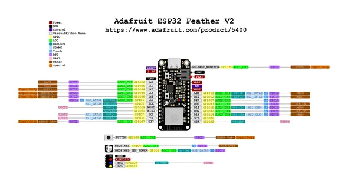

# Feather ESP32 V2

**Adafruit** · ESP32 original

Revision: Not identified  
Coverage: Pinout image collected

[Browse all manufacturers](../../../../BROWSE.md) · [Desktop app](https://github.com/valleytechsolutions/black-wire-desktop)

## Pinout reference - PDF page 1

**pinout image** · Reviewed source · PNG

[Open original reference](../../../../library/media/238ad86aac28745ab6a4d38672e61fcb94a2e23567d26093be35f94506fdc726.png)

**Credit and rights:** Not established; source attribution retained. Source/manufacturer: Adafruit.

[Source 1](https://raw.githubusercontent.com/adafruit/Adafruit-ESP32-Feather-V2-PCB/main/Adafruit ESP32 Feather V2 Pinout.pdf) · [Source 2](https://learn.adafruit.com/adafruit-esp32-feather-v2/pinouts)

 Original PDF page 1 rendered at 220 dpi; no labels changed.

SHA-256: `238ad86aac28745ab6a4d38672e61fcb94a2e23567d26093be35f94506fdc726`

## Manufacturer pinout PDF

**original reference PDF** · Reviewed source · PDF

[Open original reference](../../../../library/media/52ae2016358ff5cc507d4a5eb567f686f539d6493590a9ecce11da062d848d5e.pdf)

**Credit and rights:** Not established; source attribution retained. Source/manufacturer: Adafruit.

[Source 1](https://raw.githubusercontent.com/adafruit/Adafruit-ESP32-Feather-V2-PCB/main/Adafruit ESP32 Feather V2 Pinout.pdf) · [Source 2](https://learn.adafruit.com/adafruit-esp32-feather-v2/pinouts)

SHA-256: `52ae2016358ff5cc507d4a5eb567f686f539d6493590a9ecce11da062d848d5e`

Pin assignments have not been independently electrically verified. Check board revision before wiring.
