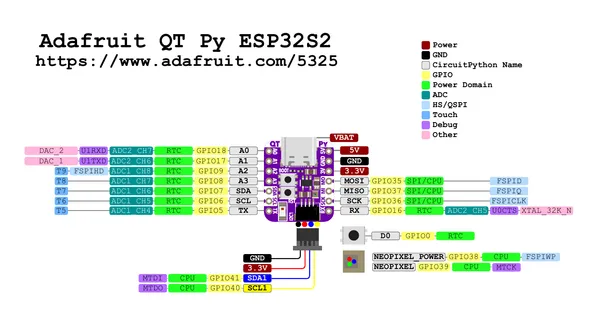

# Adafruit QT Py ESP32-S2 (including uFL version)

**Adafruit** · ESP32-S2

Revision: Not identified  
Coverage: Pinout image collected

[Browse all manufacturers](../../../../BROWSE.md) · [Desktop app](https://github.com/valleytechsolutions/black-wire-desktop)

## Pinout reference - PDF page 1

**pinout image** · Reviewed source · PNG

[Open original reference](../../../../library/media/2a084560b8b8ebc53ae67bd8ecd43d09d2270856c9d6bebdf16c22b8f844511a.png)

**Credit and rights:** Not established; source attribution retained. Source/manufacturer: Adafruit.

[Source 1](https://raw.githubusercontent.com/adafruit/Adafruit-QT-Py-ESP32-S2-PCB/main/Adafruit%20QT%20Py%20ESP32-S2%20Pinout.pdf) · [Source 2](https://learn.adafruit.com/adafruit-qt-py-esp32-s2/pinouts)

Discovered from CircuitPython board metadata and the linked product/documentation page. Exact hardware revision requires matching to the diagram. Original PDF page 1 rendered at 220 dpi; no labels changed.

SHA-256: `2a084560b8b8ebc53ae67bd8ecd43d09d2270856c9d6bebdf16c22b8f844511a`

## Physical board pinout

**original reference PDF** · Reviewed source · PDF

[Open original reference](../../../../library/media/11347853a9af637167bd3f1158b751c842b518169cbb251fed7b04b3405db42b.pdf)

**Credit and rights:** Not established; source attribution retained. Source/manufacturer: Adafruit.

[Source 1](https://raw.githubusercontent.com/adafruit/Adafruit-QT-Py-ESP32-S2-PCB/main/Adafruit%20QT%20Py%20ESP32-S2%20Pinout.pdf) · [Source 2](https://learn.adafruit.com/adafruit-qt-py-esp32-s2/pinouts)

Discovered from CircuitPython board metadata and the linked product/documentation page. Exact hardware revision requires matching to the diagram.

SHA-256: `11347853a9af637167bd3f1158b751c842b518169cbb251fed7b04b3405db42b`

Pin assignments have not been independently electrically verified. Check board revision before wiring.
