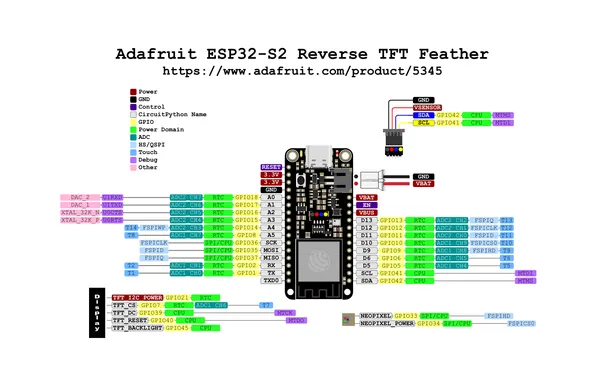
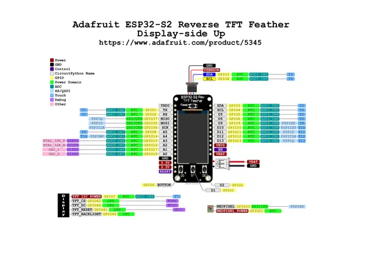

# ESP32-S2 Reverse TFT Feather

**Adafruit** · ESP32-S2

Revision: Not identified  
Coverage: Pinout image collected

[Browse all manufacturers](../../../../BROWSE.md) · [Desktop app](https://github.com/valleytechsolutions/black-wire-desktop)

## Pinout reference - PDF page 1

**pinout image** · Reviewed source · PNG

[Open original reference](../../../../library/media/b6fe04c9ccb6be2de27d098fd1ad9aef177994ba1a6827abeb03769c7ab5d59d.png)

**Credit and rights:** Not established; source attribution retained. Source/manufacturer: Adafruit.

[Source 1](https://raw.githubusercontent.com/adafruit/Adafruit-ESP32-S2-Reverse-TFT-Feather-PCB/main/Adafruit_Reverse_TFT_Feather_ESP32-S2_Pinout.pdf) · [Source 2](https://learn.adafruit.com/esp32-s2-reverse-tft-feather/pinouts)

Discovered from CircuitPython board metadata and the linked product/documentation page. Exact hardware revision requires matching to the diagram. Original PDF page 1 rendered at 220 dpi; no labels changed.

SHA-256: `b6fe04c9ccb6be2de27d098fd1ad9aef177994ba1a6827abeb03769c7ab5d59d`

## Pinout reference - PDF page 1

**pinout image** · Reviewed source · PNG

[Open original reference](../../../../library/media/83e8d38c00cbc54ac22a2534127679560ca9da4b98db41d044e448bad093767e.png)

**Credit and rights:** Not established; source attribution retained. Source/manufacturer: Adafruit.

[Source 1](https://raw.githubusercontent.com/adafruit/Adafruit-ESP32-S2-Reverse-TFT-Feather-PCB/main/Adafruit%20Reverse%20TFT%20Feather%20ESP32-S2%20Display-side%20Up%20Pinout.pdf) · [Source 2](https://learn.adafruit.com/esp32-s2-reverse-tft-feather/pinouts)

Discovered from CircuitPython board metadata and the linked product/documentation page. Exact hardware revision requires matching to the diagram. Original PDF page 1 rendered at 220 dpi; no labels changed.

SHA-256: `83e8d38c00cbc54ac22a2534127679560ca9da4b98db41d044e448bad093767e`

## Physical board pinout

**original reference PDF** · Reviewed source · PDF

[Open original reference](../../../../library/media/71f1c77520263189f64a734a33b12a89f14f405fe26075b8b12ccbd3c170007b.pdf)

**Credit and rights:** Not established; source attribution retained. Source/manufacturer: Adafruit.

[Source 1](https://raw.githubusercontent.com/adafruit/Adafruit-ESP32-S2-Reverse-TFT-Feather-PCB/main/Adafruit_Reverse_TFT_Feather_ESP32-S2_Pinout.pdf) · [Source 2](https://learn.adafruit.com/esp32-s2-reverse-tft-feather/pinouts)

Discovered from CircuitPython board metadata and the linked product/documentation page. Exact hardware revision requires matching to the diagram.

SHA-256: `71f1c77520263189f64a734a33b12a89f14f405fe26075b8b12ccbd3c170007b`

## Physical board pinout

**original reference PDF** · Reviewed source · PDF

[Open original reference](../../../../library/media/11da56d553a45369df500b11f00345bcff5db1b3d636613de4a594915f31cf44.pdf)

**Credit and rights:** Not established; source attribution retained. Source/manufacturer: Adafruit.

[Source 1](https://raw.githubusercontent.com/adafruit/Adafruit-ESP32-S2-Reverse-TFT-Feather-PCB/main/Adafruit%20Reverse%20TFT%20Feather%20ESP32-S2%20Display-side%20Up%20Pinout.pdf) · [Source 2](https://learn.adafruit.com/esp32-s2-reverse-tft-feather/pinouts)

Discovered from CircuitPython board metadata and the linked product/documentation page. Exact hardware revision requires matching to the diagram.

SHA-256: `11da56d553a45369df500b11f00345bcff5db1b3d636613de4a594915f31cf44`

Pin assignments have not been independently electrically verified. Check board revision before wiring.
