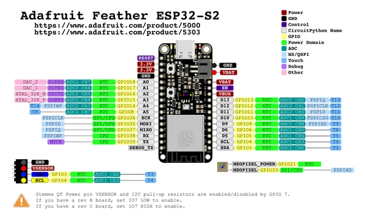

# Feather ESP32-S2

**Adafruit** · ESP32-S2

Revision: Not identified  
Coverage: Pinout image collected

[Browse all manufacturers](../../../../BROWSE.md) · [Desktop app](https://github.com/valleytechsolutions/black-wire-desktop)

## Pinout reference - PDF page 1

**pinout image** · Reviewed source · PNG

[Open original reference](../../../../library/media/6b6ac08b980e78c80b2c3bc71a2bbc86112e68e28644a92d8e0d0b9d00e2c365.png)

**Credit and rights:** Not established; source attribution retained. Source/manufacturer: Adafruit.

[Source 1](https://raw.githubusercontent.com/adafruit/Adafruit-Feather-ESP32-S2-PCB/main/Adafruit Feather ESP32-S2 Pinout.pdf) · [Source 2](https://learn.adafruit.com/adafruit-esp32-s2-feather/pinouts)

 Original PDF page 1 rendered at 220 dpi; no labels changed.

SHA-256: `6b6ac08b980e78c80b2c3bc71a2bbc86112e68e28644a92d8e0d0b9d00e2c365`

## Manufacturer pinout PDF

**original reference PDF** · Reviewed source · PDF

[Open original reference](../../../../library/media/2f0403fd07247f12603ec994bd50c2d5a228d71a366f9e94fc9adeedbeed0dd7.pdf)

**Credit and rights:** Not established; source attribution retained. Source/manufacturer: Adafruit.

[Source 1](https://raw.githubusercontent.com/adafruit/Adafruit-Feather-ESP32-S2-PCB/main/Adafruit Feather ESP32-S2 Pinout.pdf) · [Source 2](https://learn.adafruit.com/adafruit-esp32-s2-feather/pinouts)

SHA-256: `2f0403fd07247f12603ec994bd50c2d5a228d71a366f9e94fc9adeedbeed0dd7`

Pin assignments have not been independently electrically verified. Check board revision before wiring.
