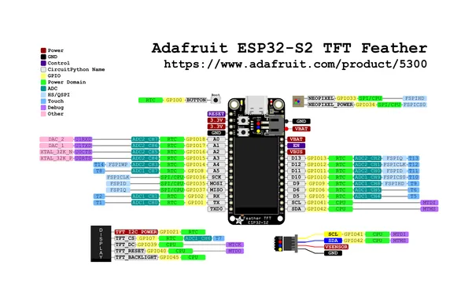

# Feather ESP32-S2 with TFT

**Adafruit** · ESP32-S2

Revision: Not identified  
Coverage: Pinout image collected

[Browse all manufacturers](../../../../BROWSE.md) · [Desktop app](https://github.com/valleytechsolutions/black-wire-desktop)

## Pinout reference - PDF page 1

**pinout image** · Reviewed source · PNG

[Open original reference](../../../../library/media/6b30089402519f30e72fa8178cb971682b682be910f841b17bca81a6d4e8183f.png)

**Credit and rights:** Not established; source attribution retained. Source/manufacturer: Adafruit.

[Source 1](https://raw.githubusercontent.com/adafruit/Adafruit-ESP32-S2-TFT-Feather-PCB/main/Adafruit%20ESP32-S2%20TFT%20Feather%20Pinout.pdf) · [Source 2](https://learn.adafruit.com/adafruit-esp32-s2-tft-feather/pinouts)

Discovered from CircuitPython board metadata and the linked product/documentation page. Exact hardware revision requires matching to the diagram. Original PDF page 1 rendered at 220 dpi; no labels changed.

SHA-256: `6b30089402519f30e72fa8178cb971682b682be910f841b17bca81a6d4e8183f`

## Physical board pinout

**original reference PDF** · Reviewed source · PDF

[Open original reference](../../../../library/media/0ce335aa12351d27ff554f02db04f0f95a48d8c9e28f78c10d90989393920525.pdf)

**Credit and rights:** Not established; source attribution retained. Source/manufacturer: Adafruit.

[Source 1](https://raw.githubusercontent.com/adafruit/Adafruit-ESP32-S2-TFT-Feather-PCB/main/Adafruit%20ESP32-S2%20TFT%20Feather%20Pinout.pdf) · [Source 2](https://learn.adafruit.com/adafruit-esp32-s2-tft-feather/pinouts)

Discovered from CircuitPython board metadata and the linked product/documentation page. Exact hardware revision requires matching to the diagram.

SHA-256: `0ce335aa12351d27ff554f02db04f0f95a48d8c9e28f78c10d90989393920525`

Pin assignments have not been independently electrically verified. Check board revision before wiring.
