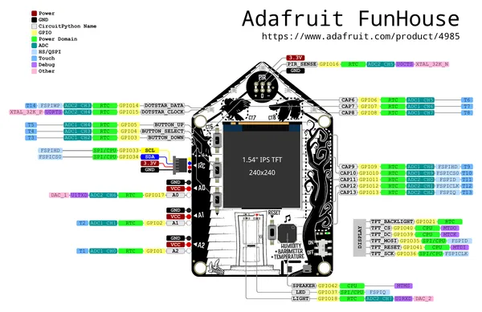

# FunHouse - WiFi Home Automation Development Board

**Adafruit** · ESP32-S2

Revision: Not identified  
Coverage: Pinout image collected

[Browse all manufacturers](../../../../BROWSE.md) · [Desktop app](https://github.com/valleytechsolutions/black-wire-desktop)

## Pinout reference - PDF page 1

**pinout image** · Reviewed source · PNG

[Open original reference](../../../../library/media/3706c60614282cc7cab1cc2119f07b953f2e8db5179b8b1118e707b7e511fa19.png)

**Credit and rights:** Not established; source attribution retained. Source/manufacturer: Adafruit.

[Source 1](https://raw.githubusercontent.com/adafruit/Adafruit-FunHouse-PCB/main/Adafruit%20FunHouse%20ESP32-S2%20pinout.pdf) · [Source 2](https://learn.adafruit.com/adafruit-funhouse/pinouts)

Discovered from CircuitPython board metadata and the linked product/documentation page. Exact hardware revision requires matching to the diagram. Original PDF page 1 rendered at 220 dpi; no labels changed.

SHA-256: `3706c60614282cc7cab1cc2119f07b953f2e8db5179b8b1118e707b7e511fa19`

## Physical board pinout

**original reference PDF** · Reviewed source · PDF

[Open original reference](../../../../library/media/d3d85f857c41c5c89df9e997c013446bf117cedb8b5e17e5637b70905ebaf139.pdf)

**Credit and rights:** Not established; source attribution retained. Source/manufacturer: Adafruit.

[Source 1](https://raw.githubusercontent.com/adafruit/Adafruit-FunHouse-PCB/main/Adafruit%20FunHouse%20ESP32-S2%20pinout.pdf) · [Source 2](https://learn.adafruit.com/adafruit-funhouse/pinouts)

Discovered from CircuitPython board metadata and the linked product/documentation page. Exact hardware revision requires matching to the diagram.

SHA-256: `d3d85f857c41c5c89df9e997c013446bf117cedb8b5e17e5637b70905ebaf139`

Pin assignments have not been independently electrically verified. Check board revision before wiring.
