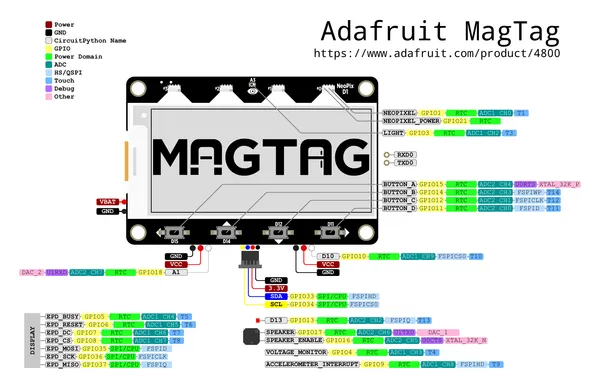

# MagTag - 2.9\" Grayscale E-Ink WiFi Display

**Adafruit** · ESP32-S2

Revision: Not identified  
Coverage: Pinout image collected

[Browse all manufacturers](../../../../BROWSE.md) · [Desktop app](https://github.com/valleytechsolutions/black-wire-desktop)

## Pinout reference - PDF page 1

**pinout image** · Reviewed source · PNG

[Open original reference](../../../../library/media/60548ca69a8e9303efce0a4a9ceed5bad7d92daf8c5647ba6da119cf531af54d.png)

**Credit and rights:** Not established; source attribution retained. Source/manufacturer: Adafruit.

[Source 1](https://raw.githubusercontent.com/adafruit/Adafruit_MagTag_PCBs/main/Adafruit%20MagTag%20ESP32-S2%20pinout.pdf) · [Source 2](https://learn.adafruit.com/adafruit-magtag/pinouts)

Discovered from CircuitPython board metadata and the linked product/documentation page. Exact hardware revision requires matching to the diagram. Original PDF page 1 rendered at 220 dpi; no labels changed.

SHA-256: `60548ca69a8e9303efce0a4a9ceed5bad7d92daf8c5647ba6da119cf531af54d`

## Physical board pinout

**original reference PDF** · Reviewed source · PDF

[Open original reference](../../../../library/media/d00301301ced459a45f3aad78ac4758b95dc3cce4a96f9f37a7f09e739c47114.pdf)

**Credit and rights:** Not established; source attribution retained. Source/manufacturer: Adafruit.

[Source 1](https://raw.githubusercontent.com/adafruit/Adafruit_MagTag_PCBs/main/Adafruit%20MagTag%20ESP32-S2%20pinout.pdf) · [Source 2](https://learn.adafruit.com/adafruit-magtag/pinouts)

Discovered from CircuitPython board metadata and the linked product/documentation page. Exact hardware revision requires matching to the diagram.

SHA-256: `d00301301ced459a45f3aad78ac4758b95dc3cce4a96f9f37a7f09e739c47114`

Pin assignments have not been independently electrically verified. Check board revision before wiring.
