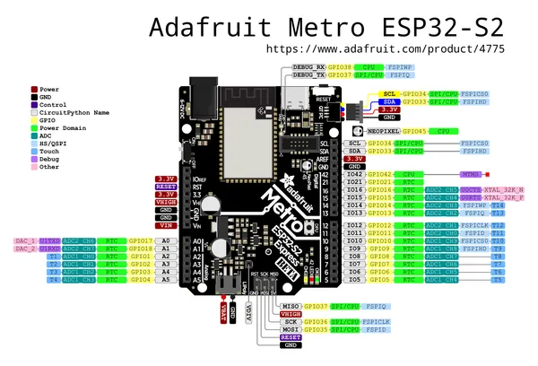

# Metro ESP32-S2

**Adafruit** · ESP32-S2

Revision: Not identified  
Coverage: Pinout image collected

[Browse all manufacturers](../../../../BROWSE.md) · [Desktop app](https://github.com/valleytechsolutions/black-wire-desktop)

## Pinout reference - PDF page 1

**pinout image** · Reviewed source · PNG

[Open original reference](../../../../library/media/9282d0e9df6e946f64a8a5ea376a2a25bc1b95cf7630a42df9b393f2e1319b51.png)

**Credit and rights:** Not established; source attribution retained. Source/manufacturer: Adafruit.

[Source 1](https://raw.githubusercontent.com/adafruit/Adafruit-Metro-ESP32-S2-PCB/master/Adafruit%20Metro%20ESP32-S2%20pinout.pdf) · [Source 2](https://learn.adafruit.com/adafruit-metro-esp32-s2/pinouts)

Discovered from CircuitPython board metadata and the linked product/documentation page. Exact hardware revision requires matching to the diagram. Original PDF page 1 rendered at 220 dpi; no labels changed.

SHA-256: `9282d0e9df6e946f64a8a5ea376a2a25bc1b95cf7630a42df9b393f2e1319b51`

## Physical board pinout

**original reference PDF** · Reviewed source · PDF

[Open original reference](../../../../library/media/a69391ab5d46dde1d10c7e7491b4b5a0279f29bb8a742e59025406303ef7fdc4.pdf)

**Credit and rights:** Not established; source attribution retained. Source/manufacturer: Adafruit.

[Source 1](https://raw.githubusercontent.com/adafruit/Adafruit-Metro-ESP32-S2-PCB/master/Adafruit%20Metro%20ESP32-S2%20pinout.pdf) · [Source 2](https://learn.adafruit.com/adafruit-metro-esp32-s2/pinouts)

Discovered from CircuitPython board metadata and the linked product/documentation page. Exact hardware revision requires matching to the diagram.

SHA-256: `a69391ab5d46dde1d10c7e7491b4b5a0279f29bb8a742e59025406303ef7fdc4`

Pin assignments have not been independently electrically verified. Check board revision before wiring.
