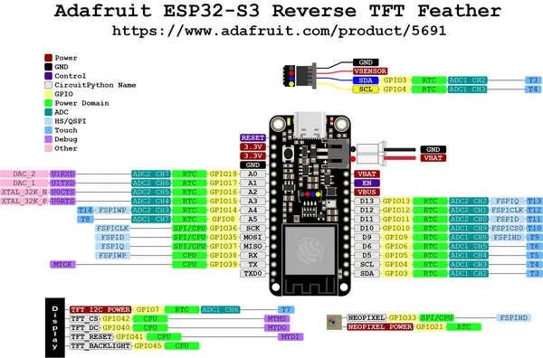
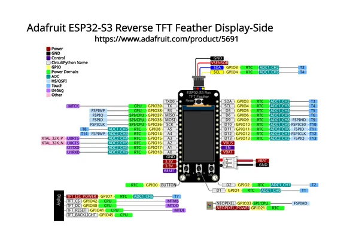
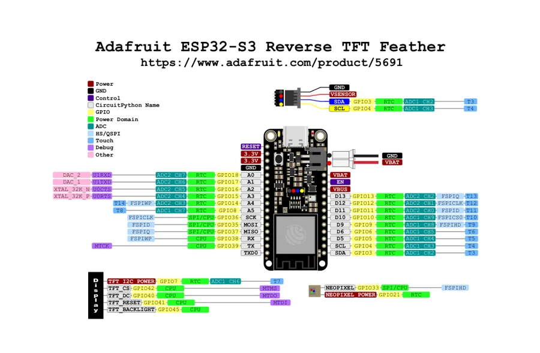
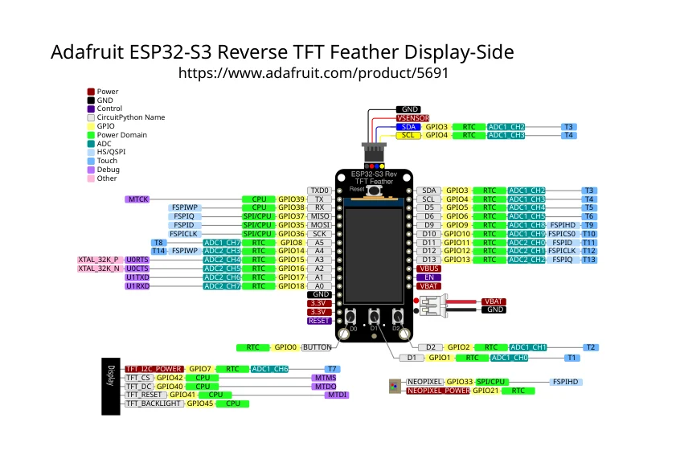

# ESP32-S3 Reverse TFT Feather

**Adafruit** · ESP32-S3

Revision: Not identified

Coverage: Physical pinout source collected; scope and revision require confirmation

[Browse all manufacturers](../../../../BROWSE.md) · [Devices & IoT](../../../../DEVICES.md) · [Open in the browser guide](https://valleytech-black-wire-guide.pages.dev/?board=adafruit-esp32-esp32-s3-reverse-tft-feather)

Architecture: **Xtensa**

## Specifications and hardware documentation

- [Specifications & hardware guide](https://www.adafruit.com/product/5691)

## Physical board pinout

**pinout image** · Reviewed source · PNG

[Open original reference](../../../../library/media/14aef24f2fc5b8963a52ef238a79029d4bc9ee87783be413e4e0bf501d0b6984.png)

**Credit and rights:** Not established; source attribution retained. Source/manufacturer: Adafruit.

[Source 1](https://cdn-learn.adafruit.com/assets/assets/000/139/943/original/adafruit_products_Adafruit_ESP32-S3_Reverse_TFT_Feather_Pinout.png?1758743002) · [Source 2](https://learn.adafruit.com/esp32-s3-reverse-tft-feather/pinouts)

Discovered from CircuitPython board metadata and the linked product/documentation page. Exact hardware revision requires matching to the diagram.

Image revision: Not identified

SHA-256: `14aef24f2fc5b8963a52ef238a79029d4bc9ee87783be413e4e0bf501d0b6984`

## Physical board pinout

**pinout image** · Reviewed source · JPG

[Open original reference](../../../../library/media/9e1b91d61ebef01034dd176b8b253d0e6a945c8b807e6bf260aac21ba8e0dd7d.jpg)

**Credit and rights:** Not established; source attribution retained. Source/manufacturer: Adafruit.

[Source 1](https://cdn-learn.adafruit.com/assets/assets/000/133/300/original/adafruit_products_PrettyPins_Adafruit_ESP32-S3_Reverse_TFT_Feather_Display-Side_Pinout.jpg?1729891155) · [Source 2](https://learn.adafruit.com/esp32-s3-reverse-tft-feather/pinouts)

Discovered from CircuitPython board metadata and the linked product/documentation page. Exact hardware revision requires matching to the diagram.

Image revision: Not identified

SHA-256: `9e1b91d61ebef01034dd176b8b253d0e6a945c8b807e6bf260aac21ba8e0dd7d`

## Original manufacturer graphical reference (PDF)

**original reference PDF** · Reviewed source · PDF

[Open original reference](../../../../library/media/9747c97b6e247b20f84f755f2148cb0a1c8f2cf2fd7856485f630f2d18d93d84.pdf)

**Credit and rights:** Adafruit / original diagram contributors. Rights not established for this asset; attribution retained. Original artwork is not covered by Black Wire's editorial license.. Source/manufacturer: Adafruit.

[Source 1](https://raw.githubusercontent.com/adafruit/Adafruit-ESP32-S3-Reverse-TFT-Feather-PCB/633459d74623227a18f7c4b1594db0840ba5592d/Adafruit_ESP32-S3_Reverse_TFT_Feather_Pinout.pdf) · [Source 2](https://www.adafruit.com/product/5691) · [Source 3](https://learn.adafruit.com/esp32-s3-reverse-tft-feather/pinouts) · [Source 4](https://circuitpython.org/board/adafruit_feather_esp32s3_reverse_tft/) · [Source 5](https://github.com/adafruit/Adafruit-ESP32-S3-Reverse-TFT-Feather-PCB/tree/633459d74623227a18f7c4b1594db0840ba5592d)

Original publisher reference. Exact board/revision and electrical limits still require confirmation.

Image revision: Not identified

SHA-256: `9747c97b6e247b20f84f755f2148cb0a1c8f2cf2fd7856485f630f2d18d93d84`

## Manufacturer board pinout — page 1

**pinout image** · Reviewed source · PNG

[Open original reference](../../../../library/media/960894ad9667199c282f578e986a99e3a054b9cc52b99acd675a74e79c7e47a6.png)

**Credit and rights:** Adafruit / original diagram contributors. Rights not established for this asset; attribution retained. Original artwork is not covered by Black Wire's editorial license.. Source/manufacturer: Adafruit.

[Source 1](https://raw.githubusercontent.com/adafruit/Adafruit-ESP32-S3-Reverse-TFT-Feather-PCB/633459d74623227a18f7c4b1594db0840ba5592d/Adafruit_ESP32-S3_Reverse_TFT_Feather_Pinout.pdf) · [Source 2](https://www.adafruit.com/product/5691) · [Source 3](https://learn.adafruit.com/esp32-s3-reverse-tft-feather/pinouts) · [Source 4](https://circuitpython.org/board/adafruit_feather_esp32s3_reverse_tft/) · [Source 5](https://github.com/adafruit/Adafruit-ESP32-S3-Reverse-TFT-Feather-PCB/tree/633459d74623227a18f7c4b1594db0840ba5592d)

Original publisher reference. Exact board/revision and electrical limits still require confirmation.  PDF page rendered at 144 dpi without changing labels. Original vector PDF retained.

Image revision: Not identified

SHA-256: `960894ad9667199c282f578e986a99e3a054b9cc52b99acd675a74e79c7e47a6`

## Original manufacturer graphical reference (PDF)

**original reference PDF** · Reviewed source · PDF

[Open original reference](../../../../library/media/568b628edc4de19d2d73db87aeea9d2c36938f332629fbe4c5af3e02489e34cd.pdf)

**Credit and rights:** Adafruit / original diagram contributors. Rights not established for this asset; attribution retained. Original artwork is not covered by Black Wire's editorial license.. Source/manufacturer: Adafruit.

[Source 1](https://raw.githubusercontent.com/adafruit/Adafruit-ESP32-S3-Reverse-TFT-Feather-PCB/633459d74623227a18f7c4b1594db0840ba5592d/PrettyPins%20Adafruit%20ESP32-S3%20Reverse%20TFT%20Feather%20Display-Side%20Pinout.pdf) · [Source 2](https://www.adafruit.com/product/5691) · [Source 3](https://learn.adafruit.com/esp32-s3-reverse-tft-feather/pinouts) · [Source 4](https://circuitpython.org/board/adafruit_feather_esp32s3_reverse_tft/) · [Source 5](https://github.com/adafruit/Adafruit-ESP32-S3-Reverse-TFT-Feather-PCB/tree/633459d74623227a18f7c4b1594db0840ba5592d)

Original publisher reference. Exact board/revision and electrical limits still require confirmation.

Image revision: Not identified

SHA-256: `568b628edc4de19d2d73db87aeea9d2c36938f332629fbe4c5af3e02489e34cd`

## Manufacturer board pinout — page 1

**pinout image** · Reviewed source · PNG

[Open original reference](../../../../library/media/831e5a451723f22a00f2b2250d9044b63b508c0cf37fa86c83f5daa16777e8a3.png)

**Credit and rights:** Adafruit / original diagram contributors. Rights not established for this asset; attribution retained. Original artwork is not covered by Black Wire's editorial license.. Source/manufacturer: Adafruit.

[Source 1](https://raw.githubusercontent.com/adafruit/Adafruit-ESP32-S3-Reverse-TFT-Feather-PCB/633459d74623227a18f7c4b1594db0840ba5592d/PrettyPins%20Adafruit%20ESP32-S3%20Reverse%20TFT%20Feather%20Display-Side%20Pinout.pdf) · [Source 2](https://www.adafruit.com/product/5691) · [Source 3](https://learn.adafruit.com/esp32-s3-reverse-tft-feather/pinouts) · [Source 4](https://circuitpython.org/board/adafruit_feather_esp32s3_reverse_tft/) · [Source 5](https://github.com/adafruit/Adafruit-ESP32-S3-Reverse-TFT-Feather-PCB/tree/633459d74623227a18f7c4b1594db0840ba5592d)

Original publisher reference. Exact board/revision and electrical limits still require confirmation.  PDF page rendered at 144 dpi without changing labels. Original vector PDF retained.

Image revision: Not identified

SHA-256: `831e5a451723f22a00f2b2250d9044b63b508c0cf37fa86c83f5daa16777e8a3`

Pin assignments have not been independently electrically verified. Check board revision before wiring.
