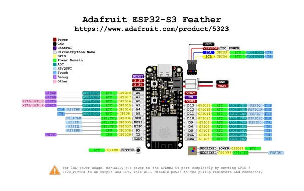

# Feather ESP32-S3 4MB Flash 2MB PSRAM

**Adafruit** · ESP32-S3

Revision: Not identified  
Coverage: Pinout image collected

[Browse all manufacturers](../../../../BROWSE.md) · [Desktop app](https://github.com/valleytechsolutions/black-wire-desktop)

## Pinout reference - PDF page 1

**pinout image** · Reviewed source · PNG

[Open original reference](../../../../library/media/f2db52757f37a9868510bbbe85485e7dc87598d6ca493b2c482c6d328234f8ac.png)

**Credit and rights:** Not established; source attribution retained. Source/manufacturer: Adafruit.

[Source 1](https://raw.githubusercontent.com/adafruit/Adafruit-Feather-ESP32-S3-PCB/main/Adafruit%20Feather%20ESP32-S3%20Pinout.pdf) · [Source 2](https://learn.adafruit.com/adafruit-esp32-s3-feather/pinouts)

Discovered from CircuitPython board metadata and the linked product/documentation page. Exact hardware revision requires matching to the diagram. Page is shared with: Feather ESP32-S3 8MB Flash No PSRAM. Original PDF page 1 rendered at 220 dpi; no labels changed.

SHA-256: `f2db52757f37a9868510bbbe85485e7dc87598d6ca493b2c482c6d328234f8ac`

## Physical board pinout

**original reference PDF** · Reviewed source · PDF

[Open original reference](../../../../library/media/41b8de067929ee3ad1d601bfa220d2ccf97621d733fa10dc374ad2daa696d811.pdf)

**Credit and rights:** Not established; source attribution retained. Source/manufacturer: Adafruit.

[Source 1](https://raw.githubusercontent.com/adafruit/Adafruit-Feather-ESP32-S3-PCB/main/Adafruit%20Feather%20ESP32-S3%20Pinout.pdf) · [Source 2](https://learn.adafruit.com/adafruit-esp32-s3-feather/pinouts)

Discovered from CircuitPython board metadata and the linked product/documentation page. Exact hardware revision requires matching to the diagram. Page is shared with: Feather ESP32-S3 8MB Flash No PSRAM.

SHA-256: `41b8de067929ee3ad1d601bfa220d2ccf97621d733fa10dc374ad2daa696d811`

Pin assignments have not been independently electrically verified. Check board revision before wiring.
