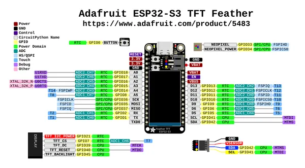

# Feather ESP32-S3 TFT PSRAM

**Adafruit** · ESP32-S3

Revision: Not identified

Coverage: Pinout image collected

[Browse all manufacturers](../../../../BROWSE.md) · [Devices & IoT](../../../../DEVICES.md) · [Open in the browser guide](https://valleytech-black-wire-guide.pages.dev/?board=adafruit-esp32-feather-esp32-s3-tft-psram)

## Datasheets and original documentation

Board datasheet: **not yet recorded**. Visual reference: **available**.

[Manufacturer source (recorded link)](https://learn.adafruit.com/adafruit-esp32-s3-tft-feather/pinouts)

A chip datasheet, schematic and board datasheet have different scopes. Match the exact hardware revision.

[Documentation coverage and remaining gaps](../../../../DOCUMENTATION.md)

## Pinout reference - PDF page 1

**pinout image** · Reviewed source · PNG

[Open original reference](../../../../library/media/f9364553b74d09a1e9a7883e0a75e2655804796428cde8432833b4e1f21ff8ab.png)

**Credit and rights:** Not established; source attribution retained. Source/manufacturer: Adafruit.

[Source 1](https://raw.githubusercontent.com/adafruit/Adafruit-ESP32-S3-TFT-Feather-PCB/main/Adafruit%20ESP32-S3%20TFT%20Feather%20Pinout.pdf) · [Source 2](https://learn.adafruit.com/adafruit-esp32-s3-tft-feather/pinouts)

Discovered from CircuitPython board metadata and the linked product/documentation page. Exact hardware revision requires matching to the diagram. Original PDF page 1 rendered at 220 dpi; no labels changed.

Image revision: Not identified

SHA-256: `f9364553b74d09a1e9a7883e0a75e2655804796428cde8432833b4e1f21ff8ab`

## Physical board pinout

**original reference PDF** · Reviewed source · PDF

[Open original reference](../../../../library/media/361a3243b49dea6ada5756bed0d2dc6959ea19bf4456d1c2fd5951ab50f3c26c.pdf)

**Credit and rights:** Not established; source attribution retained. Source/manufacturer: Adafruit.

[Source 1](https://raw.githubusercontent.com/adafruit/Adafruit-ESP32-S3-TFT-Feather-PCB/main/Adafruit%20ESP32-S3%20TFT%20Feather%20Pinout.pdf) · [Source 2](https://learn.adafruit.com/adafruit-esp32-s3-tft-feather/pinouts)

Discovered from CircuitPython board metadata and the linked product/documentation page. Exact hardware revision requires matching to the diagram.

Image revision: Not identified

SHA-256: `361a3243b49dea6ada5756bed0d2dc6959ea19bf4456d1c2fd5951ab50f3c26c`

Pin assignments have not been independently electrically verified. Check board revision before wiring.
