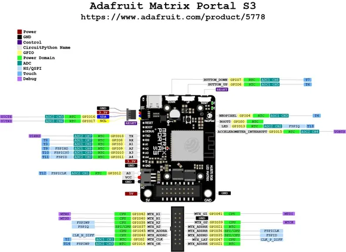
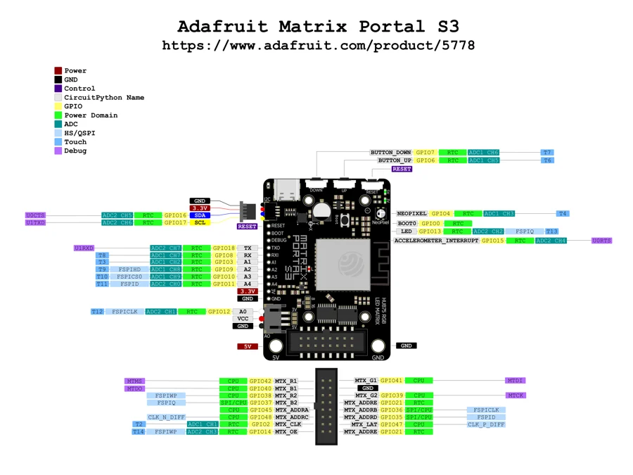

# MatrixPortal S3

**Adafruit** · ESP32-S3

Revision: Not identified

Coverage: Physical pinout source collected; scope and revision require confirmation

[Browse all manufacturers](../../../../BROWSE.md) · [Devices & IoT](../../../../DEVICES.md) · [Open in the browser guide](https://valleytech-black-wire-guide.pages.dev/?board=adafruit-esp32-matrixportal-s3)

Architecture: **Xtensa**

## Specifications and hardware documentation

- [Specifications & hardware guide](https://www.adafruit.com/product/5778)

## Physical board pinout

**pinout image** · Reviewed source · JPG

[Open original reference](../../../../library/media/b0ca638fbc1a75772fa8b9005ede4b274d4824ac14e2a3e9079aa4a194596069.jpg)

**Credit and rights:** Not established; source attribution retained. Source/manufacturer: Adafruit.

[Source 1](https://cdn-learn.adafruit.com/assets/assets/000/140/086/original/led_matrices_Adafruit_Matrix_Portal_S3_PrettyPins.jpg?1759351254) · [Source 2](https://learn.adafruit.com/adafruit-matrixportal-s3/pinouts)

Discovered from CircuitPython board metadata and the linked product/documentation page. Exact hardware revision requires matching to the diagram.

Image revision: Not identified

SHA-256: `b0ca638fbc1a75772fa8b9005ede4b274d4824ac14e2a3e9079aa4a194596069`

## Original manufacturer graphical reference (PDF)

**original reference PDF** · Reviewed source · PDF

[Open original reference](../../../../library/media/db0a959095f1e424b25aef614d558bb99f345551b5202f02428a1543651bceb9.pdf)

**Credit and rights:** Adafruit / original diagram contributors. Rights not established for this asset; attribution retained. Original artwork is not covered by Black Wire's editorial license.. Source/manufacturer: Adafruit.

[Source 1](https://raw.githubusercontent.com/adafruit/Adafruit-MatrixPortal-S3-PCB/1ff841b511d7dc153ae8d4c0b148d33cb3b2ba85/Adafruit_Matrix_Portal_S3_PrettyPins.pdf) · [Source 2](https://www.adafruit.com/product/5778) · [Source 3](https://learn.adafruit.com/adafruit-matrixportal-s3/pinouts) · [Source 4](https://circuitpython.org/board/adafruit_matrixportal_s3/) · [Source 5](https://github.com/adafruit/Adafruit-MatrixPortal-S3-PCB/tree/1ff841b511d7dc153ae8d4c0b148d33cb3b2ba85)

Original publisher reference. Exact board/revision and electrical limits still require confirmation.

Image revision: Not identified

SHA-256: `db0a959095f1e424b25aef614d558bb99f345551b5202f02428a1543651bceb9`

## Manufacturer board pinout — page 1

**pinout image** · Reviewed source · PNG

[Open original reference](../../../../library/media/1705ed1ca877487260f2722937fb912f2d7ab02250c9eed5915dc38da55f8d08.png)

**Credit and rights:** Adafruit / original diagram contributors. Rights not established for this asset; attribution retained. Original artwork is not covered by Black Wire's editorial license.. Source/manufacturer: Adafruit.

[Source 1](https://raw.githubusercontent.com/adafruit/Adafruit-MatrixPortal-S3-PCB/1ff841b511d7dc153ae8d4c0b148d33cb3b2ba85/Adafruit_Matrix_Portal_S3_PrettyPins.pdf) · [Source 2](https://www.adafruit.com/product/5778) · [Source 3](https://learn.adafruit.com/adafruit-matrixportal-s3/pinouts) · [Source 4](https://circuitpython.org/board/adafruit_matrixportal_s3/) · [Source 5](https://github.com/adafruit/Adafruit-MatrixPortal-S3-PCB/tree/1ff841b511d7dc153ae8d4c0b148d33cb3b2ba85)

Original publisher reference. Exact board/revision and electrical limits still require confirmation.  PDF page rendered at 144 dpi without changing labels. Original vector PDF retained.

Image revision: Not identified

SHA-256: `1705ed1ca877487260f2722937fb912f2d7ab02250c9eed5915dc38da55f8d08`

Pin assignments have not been independently electrically verified. Check board revision before wiring.
