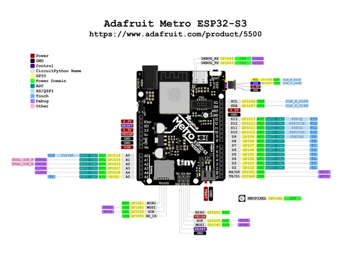

# Metro ESP32-S3

**Adafruit** · ESP32-S3

Revision: Not identified  
Coverage: Pinout image collected

[Browse all manufacturers](../../../../BROWSE.md) · [Desktop app](https://github.com/valleytechsolutions/black-wire-desktop)

## Pinout reference - PDF page 1

**pinout image** · Reviewed source · PNG

[Open original reference](../../../../library/media/0f853b1875febcd583f429699f71f2b056075a70562f45b10de641b5d378f055.png)

**Credit and rights:** Not established; source attribution retained. Source/manufacturer: Adafruit.

[Source 1](https://raw.githubusercontent.com/adafruit/Adafruit-Metro-ESP32-S3-PCB/main/Adafruit%20Metro%20ESP32-S3%20Pinout.pdf) · [Source 2](https://learn.adafruit.com/adafruit-metro-esp32-s3/pinouts)

Discovered from CircuitPython board metadata and the linked product/documentation page. Exact hardware revision requires matching to the diagram. Original PDF page 1 rendered at 220 dpi; no labels changed.

SHA-256: `0f853b1875febcd583f429699f71f2b056075a70562f45b10de641b5d378f055`

## Physical board pinout

**original reference PDF** · Reviewed source · PDF

[Open original reference](../../../../library/media/0e1e7cc357532c02d9f4fd37b96e7c7e508f3a0cc3eec50913ce117a7692a9c5.pdf)

**Credit and rights:** Not established; source attribution retained. Source/manufacturer: Adafruit.

[Source 1](https://raw.githubusercontent.com/adafruit/Adafruit-Metro-ESP32-S3-PCB/main/Adafruit%20Metro%20ESP32-S3%20Pinout.pdf) · [Source 2](https://learn.adafruit.com/adafruit-metro-esp32-s3/pinouts)

Discovered from CircuitPython board metadata and the linked product/documentation page. Exact hardware revision requires matching to the diagram.

SHA-256: `0e1e7cc357532c02d9f4fd37b96e7c7e508f3a0cc3eec50913ce117a7692a9c5`

Pin assignments have not been independently electrically verified. Check board revision before wiring.
