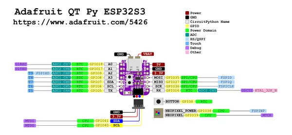

# QT Py ESP32-S3

**Adafruit** · ESP32-S3

Revision: Not identified  
Coverage: Pinout image collected

[Browse all manufacturers](../../../../BROWSE.md) · [Desktop app](https://github.com/valleytechsolutions/black-wire-desktop)

## Pinout reference - PDF page 1

**pinout image** · Reviewed source · PNG

[Open original reference](../../../../library/media/595bcb41b09177e15b48b5844260683279fe9ac9d14a1a659ff22aeb76da650b.png)

**Credit and rights:** Not established; source attribution retained. Source/manufacturer: Adafruit.

[Source 1](https://raw.githubusercontent.com/adafruit/Adafruit-QT-Py-ESP32-S3-PCB/main/Adafruit_QT_Py_ESP32-S3_Pinout.pdf) · [Source 2](https://learn.adafruit.com/adafruit-qt-py-esp32-s3/pinouts)

 Original PDF page 1 rendered at 220 dpi; no labels changed.

SHA-256: `595bcb41b09177e15b48b5844260683279fe9ac9d14a1a659ff22aeb76da650b`

## Manufacturer pinout PDF

**original reference PDF** · Reviewed source · PDF

[Open original reference](../../../../library/media/a791a8e05ccd39f945d6bde01381d27f452c7cbb6bd069dd78a269fd62a42b7e.pdf)

**Credit and rights:** Not established; source attribution retained. Source/manufacturer: Adafruit.

[Source 1](https://raw.githubusercontent.com/adafruit/Adafruit-QT-Py-ESP32-S3-PCB/main/Adafruit_QT_Py_ESP32-S3_Pinout.pdf) · [Source 2](https://learn.adafruit.com/adafruit-qt-py-esp32-s3/pinouts)

SHA-256: `a791a8e05ccd39f945d6bde01381d27f452c7cbb6bd069dd78a269fd62a42b7e`

Pin assignments have not been independently electrically verified. Check board revision before wiring.
