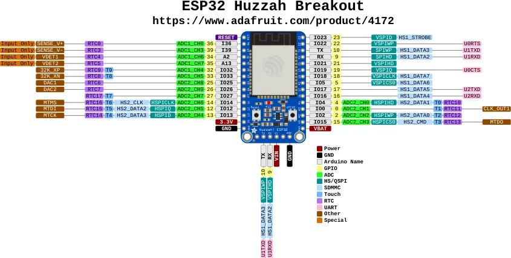

# Adafruit HUZZAH32 Breakout

**Adafruit** · ESP32

Revision: Not identified

Coverage: Physical pinout source collected; scope and revision require confirmation

[Browse all manufacturers](../../../../BROWSE.md) · [Devices & IoT](../../../../DEVICES.md) · [Open in the browser guide](https://valleytech-black-wire-guide.pages.dev/?board=adafruit-esp32-huzzah32-breakout)

Architecture: **Xtensa**

## Specifications and hardware documentation

- [Specifications & hardware guide](https://www.adafruit.com/product/4172)

## Original manufacturer graphical reference (PDF)

**original reference PDF** · Reviewed source · PDF

[Open original reference](../../../../library/media/c7d50b3ecef91d16ec83118b1f0b6f27be6fc0de368cfcfa1ba82aefd39f008a.pdf)

**Credit and rights:** Adafruit / original diagram contributors. Rights not established for this asset; attribution retained. Original artwork is not covered by Black Wire's editorial license.. Source/manufacturer: Adafruit.

[Source 1](https://raw.githubusercontent.com/adafruit/Adafruit-ESP32-HUZZAH-Breakout-PCB/2f1dcc9ebf93d4a9c825a3747d51849c088c390d/Adafruit%20ESP32%20Huzzah%20Breakout%20Pinout.pdf) · [Source 2](https://www.adafruit.com/product/4172) · [Source 3](https://circuitpython.org/board/adafruit_huzzah32_breakout/) · [Source 4](https://github.com/adafruit/Adafruit-ESP32-HUZZAH-Breakout-PCB/tree/2f1dcc9ebf93d4a9c825a3747d51849c088c390d)

Original publisher reference. Exact board/revision and electrical limits still require confirmation.

Image revision: Not identified

SHA-256: `c7d50b3ecef91d16ec83118b1f0b6f27be6fc0de368cfcfa1ba82aefd39f008a`

## Manufacturer board pinout — page 1

**pinout image** · Reviewed source · PNG

[Open original reference](../../../../library/media/7504aba8d68235775ce42ed2e08e71a5c95e14f6f4721bba933893815838724c.png)

**Credit and rights:** Adafruit / original diagram contributors. Rights not established for this asset; attribution retained. Original artwork is not covered by Black Wire's editorial license.. Source/manufacturer: Adafruit.

[Source 1](https://raw.githubusercontent.com/adafruit/Adafruit-ESP32-HUZZAH-Breakout-PCB/2f1dcc9ebf93d4a9c825a3747d51849c088c390d/Adafruit%20ESP32%20Huzzah%20Breakout%20Pinout.pdf) · [Source 2](https://www.adafruit.com/product/4172) · [Source 3](https://circuitpython.org/board/adafruit_huzzah32_breakout/) · [Source 4](https://github.com/adafruit/Adafruit-ESP32-HUZZAH-Breakout-PCB/tree/2f1dcc9ebf93d4a9c825a3747d51849c088c390d)

Original publisher reference. Exact board/revision and electrical limits still require confirmation.  PDF page rendered at 144 dpi without changing labels. Original vector PDF retained.

Image revision: Not identified

SHA-256: `7504aba8d68235775ce42ed2e08e71a5c95e14f6f4721bba933893815838724c`

Pin assignments have not been independently electrically verified. Check board revision before wiring.
