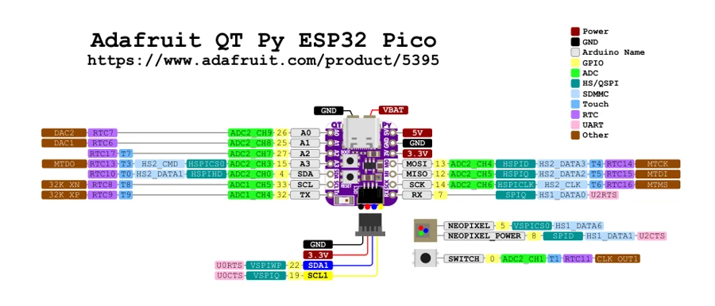

# Adafruit QT Py ESP32 Pico

**Adafruit** · ESP32

Revision: Not identified

Coverage: Physical pinout source collected; scope and revision require confirmation

[Browse all manufacturers](../../../../BROWSE.md) · [Devices & IoT](../../../../DEVICES.md) · [Open in the browser guide](https://valleytech-black-wire-guide.pages.dev/?board=adafruit-esp32-qt-py-esp32-pico)

Architecture: **Xtensa**

## Specifications and hardware documentation

- [Specifications & hardware guide](https://www.adafruit.com/product/5395)

## Original manufacturer graphical reference (PDF)

**original reference PDF** · Reviewed source · PDF

[Open original reference](../../../../library/media/b3ce1cdd793b3bcca090358a331072253b55d391f73aafe9e5e4bc7cea856a04.pdf)

**Credit and rights:** Adafruit / original diagram contributors. Rights not established for this asset; attribution retained. Original artwork is not covered by Black Wire's editorial license.. Source/manufacturer: Adafruit.

[Source 1](https://raw.githubusercontent.com/adafruit/Adafruit-QT-Py-ESP32-Pico-PCB/f45b12704ccbb7180d89db28e1af7bd861124133/Adafruit%20QT%20Py%20ESP32-Pico%20Pinout.pdf) · [Source 2](https://www.adafruit.com/product/5395) · [Source 3](https://circuitpython.org/board/adafruit_qtpy_esp32_pico/) · [Source 4](https://github.com/adafruit/Adafruit-QT-Py-ESP32-Pico-PCB/tree/f45b12704ccbb7180d89db28e1af7bd861124133)

Original publisher reference. Exact board/revision and electrical limits still require confirmation.

Image revision: Not identified

SHA-256: `b3ce1cdd793b3bcca090358a331072253b55d391f73aafe9e5e4bc7cea856a04`

## Manufacturer board pinout — page 1

**pinout image** · Reviewed source · PNG

[Open original reference](../../../../library/media/ad7072e71d1e442ebef0205abfb203321c86d2c2b77013be9803108644183802.png)

**Credit and rights:** Adafruit / original diagram contributors. Rights not established for this asset; attribution retained. Original artwork is not covered by Black Wire's editorial license.. Source/manufacturer: Adafruit.

[Source 1](https://raw.githubusercontent.com/adafruit/Adafruit-QT-Py-ESP32-Pico-PCB/f45b12704ccbb7180d89db28e1af7bd861124133/Adafruit%20QT%20Py%20ESP32-Pico%20Pinout.pdf) · [Source 2](https://www.adafruit.com/product/5395) · [Source 3](https://circuitpython.org/board/adafruit_qtpy_esp32_pico/) · [Source 4](https://github.com/adafruit/Adafruit-QT-Py-ESP32-Pico-PCB/tree/f45b12704ccbb7180d89db28e1af7bd861124133)

Original publisher reference. Exact board/revision and electrical limits still require confirmation.  PDF page rendered at 144 dpi without changing labels. Original vector PDF retained.

Image revision: Not identified

SHA-256: `ad7072e71d1e442ebef0205abfb203321c86d2c2b77013be9803108644183802`

Pin assignments have not been independently electrically verified. Check board revision before wiring.
