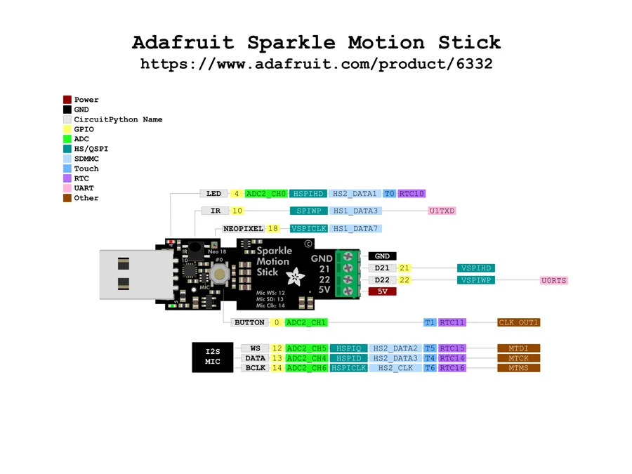

# Sparkle Motion Stick

**Adafruit** · ESP32

Revision: Not identified

Coverage: Physical pinout source collected; scope and revision require confirmation

[Browse all manufacturers](../../../../BROWSE.md) · [Devices & IoT](../../../../DEVICES.md) · [Open in the browser guide](https://valleytech-black-wire-guide.pages.dev/?board=adafruit-sparkle-motion-stick)

Architecture: **Xtensa**

## Specifications and hardware documentation

- [Specifications & hardware guide](https://www.adafruit.com/product/6332)

## Original manufacturer graphical reference (PDF)

**original reference PDF** · Reviewed source · PDF

[Open original reference](../../../../library/media/23e6b063949d01fc30fbbd9d08fcfbb4486137edc0d771cbd77aec246e2926c1.pdf)

**Credit and rights:** Adafruit / original diagram contributors. Rights not established for this asset; attribution retained. Original artwork is not covered by Black Wire's editorial license.. Source/manufacturer: Adafruit.

[Source 1](https://raw.githubusercontent.com/adafruit/Adafruit-Sparkle-Motion-Stick-PCB/5a2fd7a7e1ae0e15677335af38f3ba7fcb5a308f/Adafruit_Sparkle_Motion_Stick_PrettyPins.pdf) · [Source 2](https://www.adafruit.com/product/6332) · [Source 3](https://github.com/adafruit/Adafruit-Sparkle-Motion-Stick-PCB/tree/5a2fd7a7e1ae0e15677335af38f3ba7fcb5a308f)

Original publisher reference. Exact board/revision and electrical limits still require confirmation.

Image revision: Not identified

SHA-256: `23e6b063949d01fc30fbbd9d08fcfbb4486137edc0d771cbd77aec246e2926c1`

## Manufacturer board pinout — page 1

**pinout image** · Reviewed source · PNG

[Open original reference](../../../../library/media/a44d2fe1660ac0c81cda611e56ea4fc94c10e740c421db8d75993554d80dc18d.png)

**Credit and rights:** Adafruit / original diagram contributors. Rights not established for this asset; attribution retained. Original artwork is not covered by Black Wire's editorial license.. Source/manufacturer: Adafruit.

[Source 1](https://raw.githubusercontent.com/adafruit/Adafruit-Sparkle-Motion-Stick-PCB/5a2fd7a7e1ae0e15677335af38f3ba7fcb5a308f/Adafruit_Sparkle_Motion_Stick_PrettyPins.pdf) · [Source 2](https://www.adafruit.com/product/6332) · [Source 3](https://github.com/adafruit/Adafruit-Sparkle-Motion-Stick-PCB/tree/5a2fd7a7e1ae0e15677335af38f3ba7fcb5a308f)

Original publisher reference. Exact board/revision and electrical limits still require confirmation.  PDF page rendered at 144 dpi without changing labels. Original vector PDF retained.

Image revision: Not identified

SHA-256: `a44d2fe1660ac0c81cda611e56ea4fc94c10e740c421db8d75993554d80dc18d`

Pin assignments have not been independently electrically verified. Check board revision before wiring.
