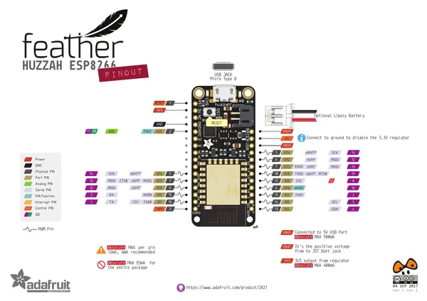

# Feather HUZZAH ESP8266

**Adafruit** · ESP8266

Revision: Not identified  
Coverage: Pinout image collected

[Browse all manufacturers](../../../../BROWSE.md) · [Desktop app](https://github.com/valleytechsolutions/black-wire-desktop)

## Graphical board pinout reference

**pinout image** · Reviewed source · PNG

[Open original reference](../../../../library/media/6234e254b9f852948db422f259367859fd7ef49ea3f8741cb3b4f549852f16c4.png)

**Credit and rights:** Not established; source attribution retained. Source/manufacturer: Adafruit.

[Source 1](https://cdn-learn.adafruit.com/assets/assets/000/046/211/original/Huzzah_ESP8266_Pinout_v1.2.pdf?1504807178) · [Source 2](https://learn.adafruit.com/adafruit-feather-huzzah-esp8266/downloads)

 Original PDF page 1 rendered at 220 dpi; no labels changed.

SHA-256: `6234e254b9f852948db422f259367859fd7ef49ea3f8741cb3b4f549852f16c4`

## Original graphical pinout datasheet

**original reference PDF** · Reviewed source · PDF

[Open original reference](../../../../library/media/0ca7a793a76d8252753f0b9d0fb6088244c4b7b65a7407940ae7996ca5ff3541.pdf)

**Credit and rights:** Not established; source attribution retained. Source/manufacturer: Adafruit.

[Source 1](https://cdn-learn.adafruit.com/assets/assets/000/046/211/original/Huzzah_ESP8266_Pinout_v1.2.pdf?1504807178) · [Source 2](https://learn.adafruit.com/adafruit-feather-huzzah-esp8266/downloads)

SHA-256: `0ca7a793a76d8252753f0b9d0fb6088244c4b7b65a7407940ae7996ca5ff3541`

Pin assignments have not been independently electrically verified. Check board revision before wiring.
