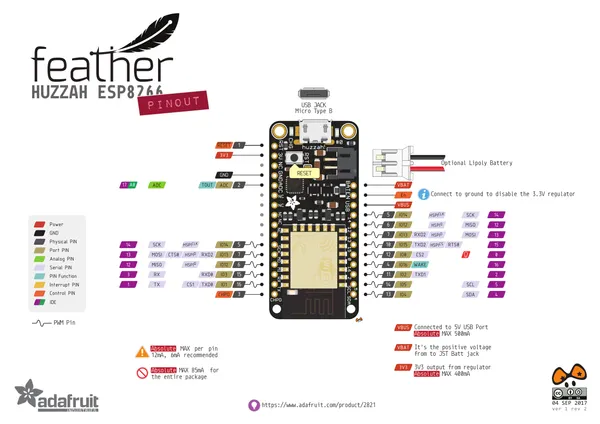

# Feather HUZZAH ESP8266

**Adafruit** · ESP8266

Revision: Not identified

Coverage: Pinout image collected

[Browse all manufacturers](../../../../BROWSE.md) · [Devices & IoT](../../../../DEVICES.md) · [Open in the browser guide](https://valleytech-black-wire-guide.pages.dev/?board=adafruit-esp32-feather-huzzah-esp8266)

## Datasheets and original documentation

Board datasheet: **not yet recorded**. Visual reference: **available**.

[Manufacturer source (recorded link)](https://learn.adafruit.com/adafruit-feather-huzzah-esp8266/downloads)

A chip datasheet, schematic and board datasheet have different scopes. Match the exact hardware revision.

[Documentation coverage and remaining gaps](../../../../DOCUMENTATION.md)

## Graphical board pinout reference

**pinout image** · Reviewed source · PNG

[Open original reference](../../../../library/media/6234e254b9f852948db422f259367859fd7ef49ea3f8741cb3b4f549852f16c4.png)

**Credit and rights:** Not established; source attribution retained. Source/manufacturer: Adafruit.

[Source 1](https://cdn-learn.adafruit.com/assets/assets/000/046/211/original/Huzzah_ESP8266_Pinout_v1.2.pdf?1504807178) · [Source 2](https://learn.adafruit.com/adafruit-feather-huzzah-esp8266/downloads)

 Original PDF page 1 rendered at 220 dpi; no labels changed.

Image revision: Not identified

SHA-256: `6234e254b9f852948db422f259367859fd7ef49ea3f8741cb3b4f549852f16c4`

## Original graphical pinout datasheet

**original reference PDF** · Reviewed source · PDF

[Open original reference](../../../../library/media/0ca7a793a76d8252753f0b9d0fb6088244c4b7b65a7407940ae7996ca5ff3541.pdf)

**Credit and rights:** Not established; source attribution retained. Source/manufacturer: Adafruit.

[Source 1](https://cdn-learn.adafruit.com/assets/assets/000/046/211/original/Huzzah_ESP8266_Pinout_v1.2.pdf?1504807178) · [Source 2](https://learn.adafruit.com/adafruit-feather-huzzah-esp8266/downloads)

Image revision: Not identified

SHA-256: `0ca7a793a76d8252753f0b9d0fb6088244c4b7b65a7407940ae7996ca5ff3541`

Pin assignments have not been independently electrically verified. Check board revision before wiring.
