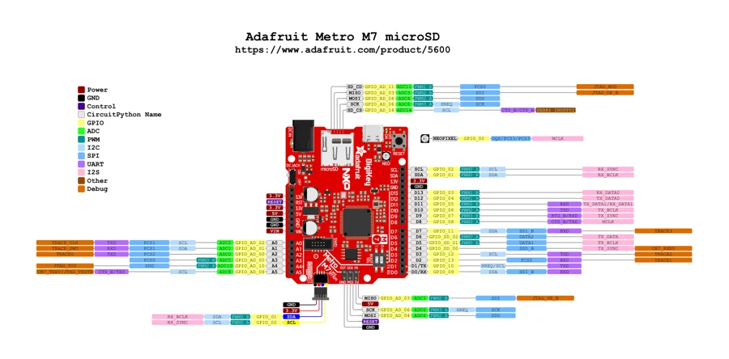

# Metro M7 with microSD

**Adafruit** · i.MX RT1011

Revision: Not identified

Coverage: Physical pinout source collected; scope and revision require confirmation

[Browse all manufacturers](../../../../BROWSE.md) · [Devices & IoT](../../../../DEVICES.md) · [Open in the browser guide](https://valleytech-black-wire-guide.pages.dev/?board=adafruit-metro-m7-with-microsd)

Architecture: **ARM**

## Specifications and hardware documentation

- [Specifications & hardware guide](https://www.adafruit.com/product/5600)

## Original manufacturer graphical reference (PDF)

**original reference PDF** · Reviewed source · PDF

[Open original reference](../../../../library/media/f1550671365fbf988c947c6847bf52c48d933ca7f4b1e3a6ef57372251235688.pdf)

**Credit and rights:** Adafruit / original diagram contributors. Rights not established for this asset; attribution retained. Original artwork is not covered by Black Wire's editorial license.. Source/manufacturer: Adafruit.

[Source 1](https://raw.githubusercontent.com/adafruit/Adafruit-Metro-M7-with-microSD-PCB/d7e0bc2ff4d5b9304a915f01442e9cbdc6535e0e/Adafruit%20Metro%20M7%20microSD%20Pinout.pdf) · [Source 2](https://www.adafruit.com/product/5600) · [Source 3](https://github.com/adafruit/Adafruit-Metro-M7-with-microSD-PCB/tree/d7e0bc2ff4d5b9304a915f01442e9cbdc6535e0e)

Original publisher reference. Exact board/revision and electrical limits still require confirmation.

Image revision: Not identified

SHA-256: `f1550671365fbf988c947c6847bf52c48d933ca7f4b1e3a6ef57372251235688`

## Manufacturer board pinout — page 1

**pinout image** · Reviewed source · PNG

[Open original reference](../../../../library/media/a0b1e5657a9122e0b7aa4ab8bbee4f91e6026c37a089e6d30bff53391cab041e.png)

**Credit and rights:** Adafruit / original diagram contributors. Rights not established for this asset; attribution retained. Original artwork is not covered by Black Wire's editorial license.. Source/manufacturer: Adafruit.

[Source 1](https://raw.githubusercontent.com/adafruit/Adafruit-Metro-M7-with-microSD-PCB/d7e0bc2ff4d5b9304a915f01442e9cbdc6535e0e/Adafruit%20Metro%20M7%20microSD%20Pinout.pdf) · [Source 2](https://www.adafruit.com/product/5600) · [Source 3](https://github.com/adafruit/Adafruit-Metro-M7-with-microSD-PCB/tree/d7e0bc2ff4d5b9304a915f01442e9cbdc6535e0e)

Original publisher reference. Exact board/revision and electrical limits still require confirmation.  PDF page rendered at 144 dpi without changing labels. Original vector PDF retained.

Image revision: Not identified

SHA-256: `a0b1e5657a9122e0b7aa4ab8bbee4f91e6026c37a089e6d30bff53391cab041e`

Pin assignments have not been independently electrically verified. Check board revision before wiring.
