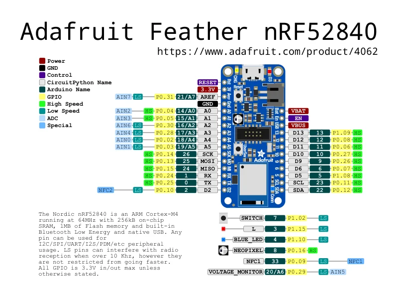

# Feather nRF52840

**Adafruit** · nRF52840

Revision: Not identified

Coverage: Physical pinout source collected; scope and revision require confirmation

[Browse all manufacturers](../../../../BROWSE.md) · [Devices & IoT](../../../../DEVICES.md) · [Open in the browser guide](https://valleytech-black-wire-guide.pages.dev/?board=adafruit-feather-nrf52840)

Architecture: **ARM**

## Specifications and hardware documentation

- [Specifications & hardware guide](https://www.adafruit.com/product/4062)

## Original manufacturer graphical reference (PDF)

**original reference PDF** · Reviewed source · PDF

[Open original reference](../../../../library/media/770adacd6f591d79b6820eb2bcf21f858f0666f8873e482225e3d928a26ca155.pdf)

**Credit and rights:** Adafruit / original diagram contributors. Rights not established for this asset; attribution retained. Original artwork is not covered by Black Wire's editorial license.. Source/manufacturer: Adafruit.

[Source 1](https://raw.githubusercontent.com/adafruit/Adafruit-nRF52-Bluefruit-Feather-PCB/20cfdfdcf656a3c3dd9d07e3db91b0f1ac79b31a/Adafruit%20Feather%20nRF52840%20pinout.pdf) · [Source 2](https://www.adafruit.com/product/4062) · [Source 3](https://github.com/adafruit/Adafruit-nRF52-Bluefruit-Feather-PCB/tree/20cfdfdcf656a3c3dd9d07e3db91b0f1ac79b31a)

Original publisher reference. Exact board/revision and electrical limits still require confirmation.

Image revision: Not identified

SHA-256: `770adacd6f591d79b6820eb2bcf21f858f0666f8873e482225e3d928a26ca155`

## Manufacturer board pinout — page 1

**pinout image** · Reviewed source · PNG

[Open original reference](../../../../library/media/a2829effc645ee6d73ce208e0457f4602538a377d46bcf371333265fc2fb3f0e.png)

**Credit and rights:** Adafruit / original diagram contributors. Rights not established for this asset; attribution retained. Original artwork is not covered by Black Wire's editorial license.. Source/manufacturer: Adafruit.

[Source 1](https://raw.githubusercontent.com/adafruit/Adafruit-nRF52-Bluefruit-Feather-PCB/20cfdfdcf656a3c3dd9d07e3db91b0f1ac79b31a/Adafruit%20Feather%20nRF52840%20pinout.pdf) · [Source 2](https://www.adafruit.com/product/4062) · [Source 3](https://github.com/adafruit/Adafruit-nRF52-Bluefruit-Feather-PCB/tree/20cfdfdcf656a3c3dd9d07e3db91b0f1ac79b31a)

Original publisher reference. Exact board/revision and electrical limits still require confirmation.  PDF page rendered at 144 dpi without changing labels. Original vector PDF retained.

Image revision: Not identified

SHA-256: `a2829effc645ee6d73ce208e0457f4602538a377d46bcf371333265fc2fb3f0e`

Pin assignments have not been independently electrically verified. Check board revision before wiring.
