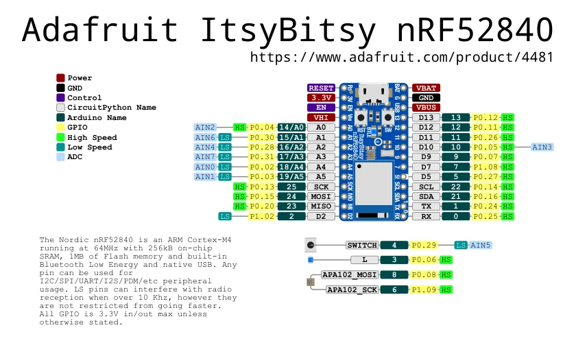

# ItsyBitsy nRF52840

**Adafruit** · nRF52840

Revision: Not identified

Coverage: Physical pinout source collected; scope and revision require confirmation

[Browse all manufacturers](../../../../BROWSE.md) · [Devices & IoT](../../../../DEVICES.md) · [Open in the browser guide](https://valleytech-black-wire-guide.pages.dev/?board=adafruit-itsybitsy-nrf52840)

Architecture: **ARM**

## Specifications and hardware documentation

- [Specifications & hardware guide](https://www.adafruit.com/product/4481)

## Original manufacturer graphical reference (PDF)

**original reference PDF** · Reviewed source · PDF

[Open original reference](../../../../library/media/c8a85c38240982d6d190b08152ea53c6fdbed0d1afd630fe886573630072f852.pdf)

**Credit and rights:** Adafruit / original diagram contributors. Rights not established for this asset; attribution retained. Original artwork is not covered by Black Wire's editorial license.. Source/manufacturer: Adafruit.

[Source 1](https://raw.githubusercontent.com/adafruit/Adafruit-ItsyBitsy-nRF52840-Express-PCB/3a3a478c8059b5ab06fbf25c2583ac7d3a8ca3eb/Adafruit%20ItsyBitsy%20nRF52840%20pinout.pdf) · [Source 2](https://www.adafruit.com/product/4481) · [Source 3](https://github.com/adafruit/Adafruit-ItsyBitsy-nRF52840-Express-PCB/tree/3a3a478c8059b5ab06fbf25c2583ac7d3a8ca3eb)

Original publisher reference. Exact board/revision and electrical limits still require confirmation.

Image revision: Not identified

SHA-256: `c8a85c38240982d6d190b08152ea53c6fdbed0d1afd630fe886573630072f852`

## Manufacturer board pinout — page 1

**pinout image** · Reviewed source · PNG

[Open original reference](../../../../library/media/bdd5211a6210c225db6361c048fabebfa3139d1f0c6b9d55722dbd538932f6b1.png)

**Credit and rights:** Adafruit / original diagram contributors. Rights not established for this asset; attribution retained. Original artwork is not covered by Black Wire's editorial license.. Source/manufacturer: Adafruit.

[Source 1](https://raw.githubusercontent.com/adafruit/Adafruit-ItsyBitsy-nRF52840-Express-PCB/3a3a478c8059b5ab06fbf25c2583ac7d3a8ca3eb/Adafruit%20ItsyBitsy%20nRF52840%20pinout.pdf) · [Source 2](https://www.adafruit.com/product/4481) · [Source 3](https://github.com/adafruit/Adafruit-ItsyBitsy-nRF52840-Express-PCB/tree/3a3a478c8059b5ab06fbf25c2583ac7d3a8ca3eb)

Original publisher reference. Exact board/revision and electrical limits still require confirmation.  PDF page rendered at 144 dpi without changing labels. Original vector PDF retained.

Image revision: Not identified

SHA-256: `bdd5211a6210c225db6361c048fabebfa3139d1f0c6b9d55722dbd538932f6b1`

Pin assignments have not been independently electrically verified. Check board revision before wiring.
