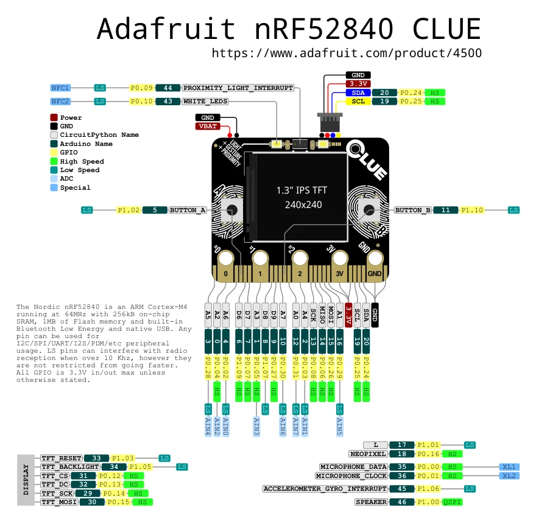

# nRF52840 CLUE

**Adafruit** · nRF52840

Revision: Not identified

Coverage: Physical pinout source collected; scope and revision require confirmation

[Browse all manufacturers](../../../../BROWSE.md) · [Devices & IoT](../../../../DEVICES.md) · [Open in the browser guide](https://valleytech-black-wire-guide.pages.dev/?board=adafruit-nrf52840-clue)

Architecture: **ARM**

## Specifications and hardware documentation

- [Specifications & hardware guide](https://www.adafruit.com/product/4500)

## Original manufacturer graphical reference (PDF)

**original reference PDF** · Reviewed source · PDF

[Open original reference](../../../../library/media/66bcc68a595fb417cda0ae7d829bad90fd98a54e4104d9083cc8121ab635c109.pdf)

**Credit and rights:** Adafruit / original diagram contributors. Rights not established for this asset; attribution retained. Original artwork is not covered by Black Wire's editorial license.. Source/manufacturer: Adafruit.

[Source 1](https://raw.githubusercontent.com/adafruit/Adafruit-CLUE-PCB/ce323d9f40e63fbe0ae231c9287abce5d2070663/Adafruit%20nRF52840%20CLUE%20pinout.pdf) · [Source 2](https://www.adafruit.com/product/4500) · [Source 3](https://github.com/adafruit/Adafruit-CLUE-PCB/tree/ce323d9f40e63fbe0ae231c9287abce5d2070663)

Original publisher reference. Exact board/revision and electrical limits still require confirmation.

Image revision: Not identified

SHA-256: `66bcc68a595fb417cda0ae7d829bad90fd98a54e4104d9083cc8121ab635c109`

## Manufacturer board pinout — page 1

**pinout image** · Reviewed source · PNG

[Open original reference](../../../../library/media/6825935f0ea15911b37edb42fdbb306aed411fd657172e0e39bee95a973cbda2.png)

**Credit and rights:** Adafruit / original diagram contributors. Rights not established for this asset; attribution retained. Original artwork is not covered by Black Wire's editorial license.. Source/manufacturer: Adafruit.

[Source 1](https://raw.githubusercontent.com/adafruit/Adafruit-CLUE-PCB/ce323d9f40e63fbe0ae231c9287abce5d2070663/Adafruit%20nRF52840%20CLUE%20pinout.pdf) · [Source 2](https://www.adafruit.com/product/4500) · [Source 3](https://github.com/adafruit/Adafruit-CLUE-PCB/tree/ce323d9f40e63fbe0ae231c9287abce5d2070663)

Original publisher reference. Exact board/revision and electrical limits still require confirmation.  PDF page rendered at 144 dpi without changing labels. Original vector PDF retained.

Image revision: Not identified

SHA-256: `6825935f0ea15911b37edb42fdbb306aed411fd657172e0e39bee95a973cbda2`

Pin assignments have not been independently electrically verified. Check board revision before wiring.
